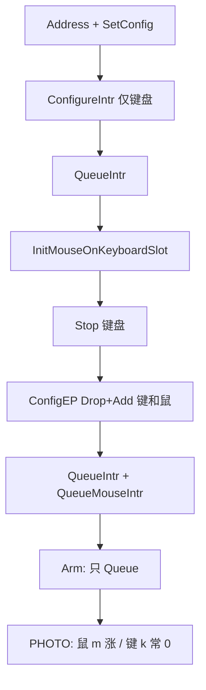
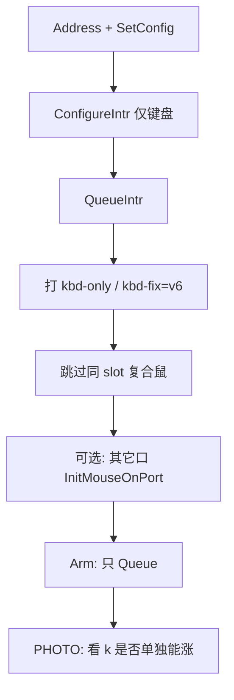

# 今日 USB 键盘逻辑对照：开盘基线 vs 当前（kbd-v6）

> **日期**：2026-09-10  
> **基线（今天第一份可对照的落盘逻辑）**：已提交 `bbfa299` 中的 `XHCI.c` 键盘/复合鼠路径（开盘时工作区也以此为起点迭代）  
> **当前**：工作区未提交迭代，版本戳 `boot: xhci build=kbd-v6`  
> **范围**：以**键盘**为主；鼠标只写与键同 slot 时如何互相影响  
> **姊妹文档**：[`真机复合USB键盘排障历程.md`](真机复合USB键盘排障历程.md)（试错编年）

---

## 0. 一句话

| | 今天开盘（`bbfa299`） | 当前（v6） |
|--|----------------------|------------|
| 键盘首次 ConfigEP | **只 Add 键盘 EP** | 真机仍是 **只 Add 键盘 EP**（这一点没变） |
| 复合鼠标怎么上 | 枚举后再 `InitMouseOnKeyboardSlot`：**Stop 键 + Drop+Add 键鼠** | 真机 **整段跳过**复合鼠（对照实验） |
| 真机 Arm | 只 `QueueIntr`，**不 Sync** | 同左（不 Sync） |
| NUC 现象目标 | 鼠已顺；键 `k=0` 待查 | 故意无复合鼠，看 **单独键盘** `k` 是否能涨 |

当前不是「回到更简单的旧逻辑」，而是：**把会弄死键的复合鼠路径从真机上拿掉做对照**。

---

## 1. 共同骨架（两边一样）

下列步骤开盘至今未改宗旨：

```text
PCI 找 xHCI → 映射 BAR → 起控制器
→ 根口 Reset / Address Device
→ GET 配置描述符 → ParseConfig（选 Boot 键盘 iface/EP）
→ SetConfig → SetProtocolBoot(kbd) → SetIdle(kbd)
→ ConfigureIntr（键盘中断 IN）→ QueueIntr
→ （可选）绑鼠标
→ 真机 irq=poll：Drain 排空事件 + 完成后再 Queue
→ PHOTO：HalInputPoll → XhciDrainEvents → 推送计 k/m
```

| 概念 | 含义 |
|------|------|
| Slot | 一个 USB 地址（复合键鼠共用一个） |
| DCI | 设备上下文索引；键常 `ep=0x82`→DCI=5，鼠常 `ep=0x81`→DCI=3 |
| ConfigEP | xHCI Configure Endpoint：按 Drop/Add 改 EP 上下文 |
| QueueIntr | 往键中断环丢 Normal TRB 并敲门铃 |
| SyncIntrDequeue | Stop EP → 重建环 → Set TR Dequeue（**Running 时不能直接 Reset**） |

---

## 2. 键盘主路径对比

### 2.1 首次配置键盘 EP — `ConfigureIntr`

**开盘基线**

- 签名：`ConfigureIntr(EpAddr, Mps, Interval, Speed)` — **只配键盘**
- Input Context：`Add = slot | kbd DCI`，`Drop = 0`
- 填键盘 EP 上下文 + `gIntrRing`，一次 ConfigEP
- 调用方：`QueueIntr()`，`gUseGetReport = 0`

**当前**

- 签名扩展为可选鼠标：`ConfigureIntr(..., MouseEp, MouseMps, MouseIv)`
- **真机 v6 调用时鼠标参数全 0** → 行为与开盘「只配键盘」等价
- QEMU 仍可一次 ConfigEP 配齐键+鼠（`MouseEp != 0`）
- 增加版本戳：`boot: xhci build=kbd-v6`

### 2.2 复合鼠标（同 slot）— 差异最大处

**开盘基线：`InitMouseOnKeyboardSlot` → `ConfigureMouseIntr`**

```text
键盘已 Running
→ Parse 鼠 iface / SetInterface / SetProtocol / SetIdle
→ ConfigureMouseIntr(composite)：
     1) Stop 键盘 EP
     2) Drop 键+鼠，Add slot+键+鼠（一次重建两端点）
     3) 键盘环用保守 MPS=8 重填
→ QueueIntr + QueueMouseIntr（注释写明：勿再 Sync，以免 PHOTO r=0）
```

设计意图（基线注释）：  
「Running 时只 Add 鼠标 → ConfigEP 看似成功但 `m` 不涨；须 Stop 再 Drop+Add。」

**NUC 后来实测**：这条路径上 **鼠标终于丝滑，键盘 `k` 长期为 0**。

**当前真机（v6）**

```text
SetConfig + SetProtocol/Idle(键盘)
→ ConfigureIntr(仅键盘) → QueueIntr
→ 打日志：kbd-only (no composite mouse) / kbd-fix=v6
→ 不调用 PrepCompositeMouse
→ 不 ConfigureMouseIntr(同 slot)
→ InitMouseOnKeyboardSlot 在真机若键已配会 skip late
→ 仍可 InitMouseOnPort（其它根口独立鼠）
```

| | 开盘基线 | 当前真机 v6 |
|--|----------|-------------|
| 同 slot 第二次 ConfigEP | **有**（Drop+Add 键鼠） | **无** |
| Stop 键盘 | 绑鼠前 **有** | **无** |
| 复合鼠 | 枚举期绑定 | **故意不绑**（对照） |
| 独立口鼠 | 有 | 有（若插在别的口） |

### 2.3 Arm（进 PHOTO 前）— `XhciEnableIrq` 真机分支

**开盘与当前一致（真机）：**

- `irq=poll`
- 清 PHOTO 统计
- `XhciDiagLogArms`（期望 `kbd=slot/dci mouse=…`）
- **只 Queue，不 Sync**（避免 Stop 把事件环弄空 → 曾 `r=t=0`）

今日中途曾试过「Arm 再 Sync 键盘」等变体，**当前代码已回到与开盘相同的「只 Queue」**。

### 2.4 今日中途加过、当前已关掉或闲置的键侧手段

这些在排障历程里有记录，**不等于开盘基线**，也**不是 v6 主路径**：

| 手段 | 作用 | 当前状态 |
|------|------|----------|
| Add-only 鼠标（不 Drop 键） | 少动键 EP | 真机 v6 不用（整段跳过复合鼠） |
| 联合 Config（一次 Add 键+鼠） | 避免第二次 Config | 仅 QEMU 可选；真机不用 |
| Recover：对 Running 直接 Reset | 想救键环 | v4 失败 `got=0x13`；已改 Stop→SetDeq，v6 主路径不跑 |
| GET_REPORT 轮询键 | EP0 兜底 | Stall `cc=6` 刷屏且 `k` 不涨；默认关 |
| FAIL `want=/got=` 全开 | 诊断 | 仍开，但 ControlXfer Stall 限 2 条 |

---

## 3. 流程图对照

### 开盘基线（复合键鼠）



### 当前真机 v6（对照）



---

## 4. 和「键盘相关」的代码锚点

| 职责 | 开盘基线（约） | 当前 |
|------|----------------|------|
| 配键盘 EP | `ConfigureIntr` 单参数版 | 同函数，多可选鼠参；真机传 0 |
| 复合鼠 ConfigEP | `ConfigureMouseIntr` Stop+Drop+Add | 仍存在；真机枚举主路径不调用 |
| 复合鼠入口 | `InitMouseOnKeyboardSlot` | 真机 late skip；主路径不再依赖它绑鼠 |
| 键恢复 | 无专门 Recover | `RecoverKbdIntr` / `ReAddKbdIntrOnly`（v6 主路径不用） |
| 版本识别 | 无 | `boot: xhci build=kbd-v6` |
| PHOTO 键死提示 | 无 `!kbdIN=0` | `XhciDiagFormat` 可附 `!kbdIN=0` |

文件：`ToyKernel/HAL/X64/Drivers/XHCI.c`。

---

## 5. 如何读下一张 PHOTO（相对本对照）

1. 必须有 **`build=kbd-v6`** 和 **`kbd-only (no composite mouse)`**，否则不是这份逻辑。  
2. **期望**：复合鼠一体时 `m` 可能为 0；盯 **`k`**。  
3. **`k>0`**：开盘「Stop+Drop+Add 复合鼠」是弄死键的主因方向 → 下一刀在「加鼠且不动死键」。  
4. **`k` 仍 0**：键单独 Config 就不吐 → 查协议/端点/门铃/事件匹配，而不是复合 Config。

---

## 6. 维护

- 基线提交：`bbfa299`（今日对照用的「第一份落盘逻辑」）。  
- 当前刀以 BootLog `build=kbd-vN` 为准；升版时改本表「当前」列并链到排障历程 §3。  
- 试错细节不重复抄：见 [`真机复合USB键盘排障历程.md`](真机复合USB键盘排障历程.md)。

（完）
