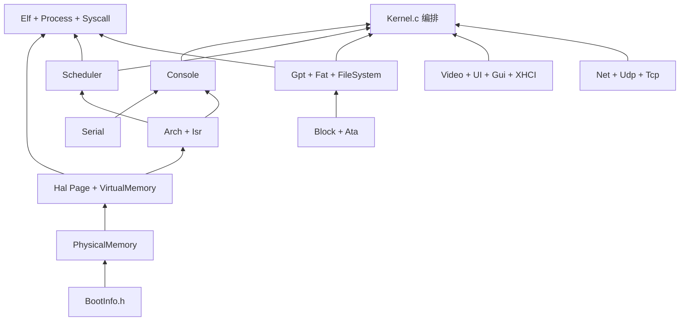

# ToyOS 技术手册（白皮书）

> **本文是唯一的详细技术指导。** 上手见 [`../README.md`](../README.md)；进度/规划见 [`路线图.md`](路线图.md)。
>
> 由原「架构分层 / 结构说明 / 板级 / 驱动 / 用户态 / 字体 / GUI 审阅」等合并。

## 目录

| 跳转 | 内容 |
|------|------|
| [I · 分层与对外接口](#tm-i-layers) | 层职责、禁止跨层、接口面 |
| [I · 模块化扩展边界](#tm-i-ext) | 加板 / 加驱动时别踩坑 |
| [I · 目录、启动与源文件](#tm-i-tree) | 树、启动顺序、函数索引 |
| [II · Boot / 板级概念](#tm-ii-concepts) | UEFI / U-Boot / DTB / 板包 |
| [II · 如何增加板级支持](#tm-ii-add-board) | 复制模板到验收 |
| [III · 驱动框架](#tm-iii-framework) | Driver 模型与 PR 对照 |
| [III · 如何增加一个驱动](#tm-iii-add-driver) | 检查清单 |
| [III · 写一个 virtio-xxx](#tm-iii-virtio) | 范例步骤 |
| [IV · 开发库](#tm-iv-libs) | CRT / libToy* / [工具链 V3](#tm-v3) |
| [IV · 第一个 GUI 程序](#tm-iv-gui) | GUIDEMO / pkg/gui |
| [IV · 字体与多语言](#tm-iv-fonts) | 点阵 / Locale |
| [IV · GUI 呈现与闪屏](#tm-iv-present) | Present / 脏区 |
| [附录 · 文档分工](#tm-appendix) | 与路线图 / README 边界 |

排期与「下一刀」不在本文 → [`路线图.md` 目录](路线图.md#目录)。

---

<a id="tm-i-layers"></a>
# I. 体系结构 — 分层与对外接口

本文描述 ToyOS **当前**分层、每层**对外暴露的接口**，以及**禁止的跨层依赖**。  
目录与文件清单见 [I · 目录、启动与源文件](#tm-i-tree)；产品排期以 [`路线图.md`](路线图.md) 为准。

---

## 1. 总览

```
┌─────────────────────────────────────────────────────────────┐
│  User（Ring 3）  User/*.S|ELF + Socket.h 常量                 │
│       ↑ syscall / sysret（或 int 0x80）                        │
├─────────────────────────────────────────────────────────────┤
│  Services   Console Gui Desktop Theme Settings  Shell/Net…   │
├─────────────────────────────────────────────────────────────┤
│  Core       Kernel  Module  PMM  VMM  Scheduler  Process      │
│             Syscall  BootInfo                                │
├─────────────────────────────────────────────────────────────┤
│  Library    Block  Gpt  Fat  Elf  UI  HIDKeyboard  CString   │
├─────────────────────────────────────────────────────────────┤
│  Fonts      Font.h + FontRegistry（字形资源，经 Font_* API） │
├─────────────────────────────────────────────────────────────┤
│  HAL        Include/Hal*.h 门面 → HAL/<Arch>/ 实现 + Drivers │
│             （HAL 收纳全部架构相关代码）                      │
├─────────────────────────────────────────────────────────────┤
│  Boot       各 Arch 自有 Boot → Startup 填 BOOT_INFO          │
│             x86：ToyBoot/UEFI；Arm/RiscV：virt + DTB / OpenSBI `-kernel` │
└─────────────────────────────────────────────────────────────┘
```

| 层 | 目录 / 仓库 | 职责一句话 |
|----|-------------|------------|
| **Boot** | 各 `HAL/<Arch>/Startup`；x86 另有 `ToyBoot/` | 填 `BOOT_INFO` 交给 Common。**x86** = UEFI/ToyBoot；**Arm/RiscV** = 自有 Boot（virt + DTB / OpenSBI `-kernel`） |
| **HAL** | `Include/Hal*.h` + `HAL/<Arch>/` | **全部**架构相关代码在此；Common **只**经门面访问硬件 |
| **Fonts** | `Fonts/` + `Include/Font.h` | 点阵字体注册与度量；绘制层不 include 某份字模表 |
| **Library** | `Common/Library/` | 可复用算法/协议（块设备、FAT、ELF…），无调度语义 |
| **Core** | `Common/Core/` | 启动组装、内存、调度、进程、系统调用 |
| **Services** | `Common/Services/` | 面向交互的子系统（Shell、GUI、主题、网络会话） |
| **User** | `User/` + FAT 上 ELF | Ring 3 程序；只许用 syscall ABI |

**依赖方向（只允许向下）**：

```
User → (syscall) → Core/Services
Services → Core / Library / Font / Hal*
Core → Library / Font / Hal* / BootInfo
Library → Hal*（Block 后端由 HAL 注册）/ BootTypes
Hal 实现 → 本 Arch Drivers（私有头，不进 Include/）
```

**硬规则**：HAL 收纳 **全部** 架构相关代码。Common 不关心 GDT 选择子、`EM_X86_64`、UEFI 类型、PL011 vs COM1、GIC vs LAPIC。Arm64 / RiscV 走自有 Boot（virt + DTB / OpenSBI `-kernel`）。

---

## 2. 跨层规则（禁止事项）

| 规则 | 说明 |
|------|------|
| ❌ Common **不得** `#include` `HAL/<Arch>/Drivers/*.h` | 用 `HalVideo` / `HalSerial` / `HalDevices` |
| ❌ Common **不得**直接写 `in`/`out` / CR3 / IDT | 用 `HalIo*` / `HalLoadPageTable` / `HalIrq*` |
| ❌ Common **不得**绑定架构细节 | 无 GDT 选择子、`EM_X86_64`、UEFI 类型、PL011 vs COM1、GIC vs LAPIC；只消费 `BOOT_INFO` 与 `Hal*` |
| ✅ Arm64 / RiscV 走自有 Boot | virt + DTB / OpenSBI `-kernel` → 本 Arch `Startup` 填 `BOOT_INFO` |
| ❌ Services **不得**解析 MADT/SIPI/页表项位布局 | SMP/页表细节留在 HAL 或 Core 的策略 API |
| ❌ Gui/Settings **不得** `#include` 具体字模 `.c` 数据 | 只调 `Font_*` / `ThemeSetFontId` |
| ❌ User 程序 **不得**链接内核 `Common/` 或调用 `Hal*` | 只通过 syscall；常量头可用 `Socket.h` |
| ❌ `BOOT_CONFIG` **不得**出现在 Common | **仅** x86：ToyBoot + `HAL/X64/BootConfig.h` + Startup |
| ✅ `BOOT_INFO` | Common **只**消费此契约（内存图、可选帧缓冲、卷提示）；由**各 Arch 的 Startup/Boot** 填写 |
| ✅ `BlockRegisterBackend` | 仅 HAL（或 Driver Block 类适配）在 Init 时调用；Common 用 `BlockRead/Write*` |
| ✅ Driver 公开面（计划） | Common 可依赖 `Driver.h` 类接口；不得依赖某驱动 `.c` 私有结构 |

---

## 3. Boot 层

Boot 按架构分路径。各 Arch 在 `HAL/<Arch>/Startup` 填好 `BOOT_INFO` 后，Common 才开始。

| Arch | Boot | 谁填 `BOOT_INFO` |
|------|------|------------------|
| x86_64 | UEFI + ToyBoot（OVMF）→ `BOOT_CONFIG` | `HAL/X64/Startup` |
| Arm64 | 自有 Boot：QEMU `virt` + DTB（ELF 时 dumpdtb+loader；PR-V1） | `HAL/Arm64/Startup` |
| RiscV | 自有 Boot：OpenSBI 默认，payload @`0x80200000`（PR-V1） | `HAL/RiscV/Startup` |

相同用户界面 = **Common Gui**。亮屏是该 Arch 的 **HAL Video**（x86：GOP；virt 上 ramfb/virtio-gpu）+ 该 Arch Boot。块设备：virtio-blk 在 HAL 注册，再接 Common FAT。

### 3.1 对外契约

| 接口 | 位置 | 调用方 | 说明 |
|------|------|--------|------|
| `BOOT_CONFIG` | ToyBoot ↔ `HAL/X64/BootConfig.h` | x86 Startup only | FB、MemoryMap、RSDP、XHCI 等；**改布局须双端同步**。Arm/RiscV **无此结构** |
| `KernelEntry(BOOT_CONFIG*)` | `HAL/X64/Startup.c` | x86 UEFI 跳转 | 转成 `BOOT_INFO` 后调 `KernelMain` |
| `BOOT_INFO` / `BootInfoGet()` | `Include/BootInfo.h` | Common | **架构无关**启动只读快照（内存图、可选帧缓冲、卷提示） |
| `VIDEO_CONFIG` / `BootInfoToVideoConfig` | 同上 | video 模块 | 帧缓冲几何；来源由该 Arch HAL/Boot 填写 |

### 3.2 Boot 职责边界

**x86（ToyBoot）**

- **做**：GOP/EDID、`THEME.CFG` 分辨率偏好、优先 **TOYOS.ID 卷**加载 `Kernel.elf`、ExitBootServices。  
- **不做**：调度、FAT 写、窗口；内核起来后 Boot 代码不再运行。

QEMU 布局：`run-split.sh` 盘0=ESP（仅 EFI），盘1=`rootfs/`（Kernel/THEME/用户 ELF）。

**Arm64 / RiscV（自有 Boot）**

- **做**：本平台固件/loader（DTB / OpenSBI 等）把内核送到入口；`HAL/<Arch>/Startup` 填 `BOOT_INFO`。virt 显示与块设备在 **该 Arch HAL**（ramfb/virtio-gpu、virtio-blk）。

---

## 4. HAL 层

公共入口：`#include "Hal.h"`（再导出 Serial/Video/Console/Devices/Port）。

### 4.1 CPU / 中断 / 定时器 / 分页 / SMP

| 分组 | 主要 API（`Hal.h`） |
|------|---------------------|
| 生命周期 | `HalInit`、`HalCpuHalt`/`Park`/`Reboot`/`Shutdown` |
| 中断 | `HalIrqEnable/Disable`、`HalIrqSave`/`Restore`、`HalCpuRelax`、`HalIrqVectorSet`、`HalIrqEoi` |
| 定时器 | `HalTimerInit`/`Start`/`Ack`/`SetInterval` |
| 用户态入口 | `HalInstallUserMode`、`HalSyscallInit`、`HalSchedulerEnter`、`HalUserEnter` |
| 任务帧（PR-A2/A15） | `HalFrameSetKernel/UserEntry`、`HalFrameGetInstructionPointer`、`HalFrameGetArgument0..2`、`HalFrameSyscallNum`、`HalFrameSetReturn*`；布局字段 `InstructionPointer`/`StackPointer`（非 x86 `Rip`/`Rsp` 名） |
| 端口 I/O | `HalIoRead/Write{8,16,32}` |
| 页表 | `HalPageKernelSetup`、`HalPageMap`、`HalPagePrepareUserRoot`、`HalPageIsCopyOnWrite`/`MarkCow`、`HalLoadPageTable`… |
| ELF | `HalElfMachine`、`HalElfRelocKind`（Common `Elf.c` 不写死机器号/重定位） |
| SMP | `HalCpuCount`/`Id`/`IsBsp`、`HalSmpStartApplicationProcessors`、`HalCpuTicks`/`TickInc` |
| 调试 | `HalDebugWrite`、`HalDebugWriteHex32/64` |
| 平台 | `HalPlatformMapMmio`、`HalPlatformXhciFallback` |

### 4.2 设备门面

| 头文件 | 对外 API 摘要 |
|--------|----------------|
| `HalSerial.h` | `HalSerialInit`、写字节/字符串、`HalSerialDataReady` |
| `HalVideo.h` | `HalVideoSet`、后缓冲 `InitBackbuffer`/`Present`、像素/矩形/字符、clip |
| `HalConsole.h` | 早期控制台与串口桥（模块 Init 可用） |
| `HalDevices.h` | `HalBlockInit`；`HalUsbInit`/`HalInputPoll`/键鼠队列；`HalNet*`（ping/发 IP/轮询） |

### 4.3 HAL 私有（不对 Common 暴露）

`HAL/<Arch>/Drivers/` 下的 `Ata.h`、`Video.h`、`Serial.h`、`XHCI.h`、`Net.h`，以及 `AcpiMadt`、`SmpTrampoline`、`BootConfig.h`。  
Arm64/RiscV **设备门面**已接 virt（ramfb/virtio-*；网见 1.2e）；**真 MMU ✅ A10**；**用户态/syscall 帧 ✅ A11**；**本 arch ELF ✅ A12**；**真 IRQ/timer ✅ A13**；**virt SMP ✅ A14**；**HalFrame 命名中立 ✅ A15**（`InstructionPointer`/`StackPointer` + `HalFrameGetInstructionPointer` / `GetArgument*`）。

---

## 5. Fonts 层

| API（`Font.h`） | 说明 |
|-----------------|------|
| `FontInit` / `FontCount` / `FontCurrentId` | 注册表 |
| `FontGetById` / `FontGetCurrent` / `FontSetById` | 切换字体 |
| `FontCellW/H`、`FontAdvanceX/Y`、`FontGlyph` | 度量与字形指针 |

**加字体**：`Fonts/` 增加数据 + `FontRegistry` 注册一行；Gui/Video **不**直接绑死某 `.c`。

---

## 6. Library 层

| 模块 | 头文件 | 对外 API 摘要 | 依赖 |
|------|--------|---------------|------|
| Block | `Block.h` | `BlockInit/Select`、`BlockRead/WriteSectors`；HAL 调 `BlockRegisterBackend` | HAL 块后端 |
| Gpt | `Gpt.h` | `GptFindFatStart` / `GptFindFatStartEx`（ESP 标记） | Block |
| Fat | `Fat.h` | `FatInit`、`FatListDir`、`FatRead/Write/DeleteFile`、`FatMkdir`/`FatRmdir`；`FAT_OK`/负错误码 + `FatStrError` | Block |
| Elf | `Elf.h` | 加载 `ET_EXEC` / `ET_DYN`（供 Process） | VMM/PMM |
| UI | `UI.h` | 按钮等绘制原语（Services 可选接入） | HalVideo |
| HIDKeyboard | `HIDKeyboard.h` | 报告 → 字符 | — |
| CString | （内部） | 简易字符串 | — |
| LibWrite（**R4**） | `LibWrite.h` | ListDir 等文本槽；ConsoleInit 注册 `ConsoleWrite`；未注册 → `HalDebugWrite` | Console |
| Driver | `Driver.h` | `ToyDriverRegister` / Probe；类设备 ops 表；**不含** ATA/virtio 私有头 | 仅类接口；后端在 HAL Drivers |

Library **不**创建任务、不直接碰 LAPIC；**不** `#include Console.h`（诊断用 `HalDebug*`/`DebugWrite`）。

### 6.1 Driver 类接口与 Block（计划）

- Library 可持有 **设备类接口**（Block / Input / Net / Display 的 ops 表与注册），见 [`驱动框架.md`](#iii-驱动--框架)。
- 具体驱动仍在 `HAL/<Arch>/Drivers/`（或按类分目录），经 `ToyDriverRegister` 进入类；Common **仍禁止** include 驱动私有头。
- 过渡期：`BlockRegisterBackend` 保留；**D2** 后由 Block 类适配层调用，FAT/VFS 只见 `Block*`。
- VFS（**1.3f**）的 `FsOps` 也属 Library/Services 边界上的可插拔面；FAT 为第一个后端。

---

## 7. Core 层

| 模块 | 头文件 | 对外 API 摘要 |
|------|--------|---------------|
| 入口 | `Kernel.h` | `KernelMain` |
| 模块表 | `KernelModules.h` / `Module.h` | `KernelModulesRun`、`ModulesRun` |
| 启动信息 | `BootInfo.h` | `BootInfoGet` / `BootInfoSet` |
| PMM | `PhysicalMemory.h` | `Allocate/Free(Pages)`、`Retain/Release`（COW） |
| VMM | `VirtualMemory.h` | 内核映射、`VIRTUAL_ADDRESS_SPACE` Create/Clone/Destroy、CopyFrom/ToUser、COW `#PF` |
| 调度 | `Scheduler.h` | Create/User、Start、`OnTimer`、Fork/Wait/Yield、FD/socket 槽 |
| 进程 | `Process.h` | `ProcessExec`、`ProcessExecve`、`ProcessRunDemo` |
| 系统调用 | `Syscall.h` | `SyscallInit`、`SyscallDispatch`；号 0–16（含 `execve`/`pipe`/`dup`/`brk`）见下 |
| Core ops（**R4**） | `CoreOps.h` | `WINDOW_OPS` / `VFS_SERVICE_OPS`；Gui/FileSystem Init 注册；Syscall/Process/TaskFd 经表调 Services |

Services 经 Init 向 Core 注册 ops；Core **不** `#include Gui.h`/`FileSystem.h`（组装表的 `KernelModules` 除外）。

### 7.1 用户可见 syscall ABI（Core 对外真正的「稳定面」）

| 号 | 名 | 要点 |
|----|-----|------|
| 0 | `exit` | 退出码 |
| 1 | `write` | fd → 文件或 socket send |
| 2 | `open` | 路径 → fd（整文件缓冲） |
| 3 | `read` | |
| 4 | `close` | 脏文件刷盘 |
| 5 | `fork` | COW |
| 6 | `wait` | `rdi=WNOHANG` 可选 |
| 7 | `yield` | |
| 8–12 | `socket`…`accept` | 需 `LWIP=1`；见 `Socket.h` |
| 13 | `execve` | 替换当前映像；`rdi=path rsi=argv rdx=envp` |
| 14 | `pipe` | `rdi=int[2]` → 读/写端 |
| 15 | `dup` | 复制 fd（管道） |
| 16 | `brk` | `rdi=new_brk`（0=查询）；堆上限 `USER_BRK_MAX` |
| 17 | `kill` | 简单信号 |
| 18–21 | 窗口协议 | create_window / damage / poll_input / ui_button |
| 22 | `FileStat` | `rdi=path rsi=TOY_FILE_STAT*`（PR-F4） |
| 23 | `OpenDirectory` | `rdi=path` → dirfd |
| 24 | `ReadDirectory` | `rdi=dirfd rsi=TOY_DIR_ENT*` → 1/0/-1 |

用户态入口：`syscall`/`sysret`（PR-SC1）或 legacy `int 0x80`；分发共用 `SyscallDispatch`。

### 7.2 模块启动顺序（Core 组装）

`serial → memory → virtual-memory → video → cpu → smp → file-system → usb → network → gui → scheduler → console`  
（见 `KernelModules.c`；串口日志为 `[mod] memory` 等全词名。失败则停机。教学骨架、识盘≠数据库、与一般 OS 的对照见 [I · 目录、启动与源文件](#tm-i-tree) 第 2 节。）

---

## 8. Services 层

| 模块 | 头文件 | 对外 API 摘要 | 典型调用方 |
|------|--------|---------------|------------|
| Console | `Console.h` | `ConsoleWrite*`、`ConsoleRegister`、焦点/提示符 | ShellTask、命令 |
| Gui | `Gui.h` | 窗口/光标/合成、`GuiOpenShell/Settings/Files`；实现拆 `GuiWm`/`Compose`/`Drag`/`Cursor`/`Focus`/`User` | GuiTask、Desktop（经 action）、Theme |
| Desktop | `Desktop.h` | 图标与双击；**只发** `DESKTOP_ACTION`（PR-R2） | Gui 鼠标路径 |
| Theme | `Theme.h` | 颜色/字体/分辨率；`ThemeLoad/Save`（DB+CFG） | Settings、启动 |
| Db | `Db.h` | `TOYOS.DB` KV；`DbGet/Set`；`dbget`/`dbset`/`dblist` | Theme、Shell |
| SettingsUi | `SettingsUi.h` | Settings 窗内容 | Gui Settings 窗 |
| FilesUi | `FilesUi.h` | 列表/预览/exec；删除确认、mkdir/新建/重命名 | Gui Files 窗 |
| ShellCommands | `ShellCommands.h` | `ShellCommandsRegister` | console Init |
| Tasks | `Tasks.h` | shell/gui/worker 任务体 | `KernelMain` |
| FileSystem | `FileSystem.h` | `Fs*`；多卷；`FsRename`/`mv` | 模块表 |
| Udp / Tcp | `Udp.h`/`Tcp.h` | 内核态自研栈（legacy） | Shell builtin |
| LwIp | `LwIp.h` | 可选生产栈开关/状态 | Shell、`LWIP=1` |

Services 可调用 Core（如 `ProcessExec`）与 Library（Fat），**经 Hal\*** 画屏/读键鼠，不直达 Drivers。

---

## 9. User 层

| 资产 | 说明 |
|------|------|
| `User/*.S` / `User/*.c` + `User/crt/` | Ring 3；CRT：`printf`/`strlen`/`memcpy`/`malloc`(brk) + `toy_syscall` |
| `User/include/` | 用户态头（勿用内核 `Include/Syscall.h`） |
| `LIBTOY.SO` | 简易动态库；JUMP_SLOT |
| libToyUi / libToyGfx（**G15** ✅；ABI/文档 **L3** ✅） | 见 [`用户态库.md`](#iv-用户态与桌面资产--开发库)、[`用户态GUI入门.md`](#iv-用户态与桌面资产--第一个-gui-程序) |
| libToyNet（**L4** ✅） | `#include <ToyNet.h>`；需 `LWIP=1` |

**允许**：`syscall` 约定寄存器传参；链接 **CRT / libtoyos / libToyUi / libToyGfx / libToyNet** 等用户态库。
**禁止**：调用 `ConsoleWrite`、`HalVideo*`、直接读 MMIO；**禁止**链接内核 `Common/` 或 `HAL/`。

用户程序构建只链用户态库（**L1** 模板）；内核 `UI.c` 是内核 Gui 参考实现，不是 User 的链接目标。

---

## 10. 数据流示例（帮助建立直觉）

### 10.1 启动到桌面

```
各 Arch 自有 Boot / Startup 填 BOOT_INFO
  （x86：ToyBoot GOP → BOOT_CONFIG → Startup；
    Arm/RiscV：DTB/OpenSBI 等 → 本 Arch Startup）
  → KernelMain → ModulesRun
  → HalVideo（该 Arch：x86 GOP；virt 上 ramfb/virtio-gpu）+ Theme + GuiInit
  → SchedulerStart → gui/shell 任务   // 相同 UI = Common Gui
```

### 10.2 用户 `exec HELLO.ELF`

```
Shell → ProcessExec → Elf 映射到用户空间
  → SchedulerCreateUser → iretq/sysret 进 Ring 3
  → write(1,…) → SyscallDispatch → Console 或 FD
```

### 10.3 键盘输入

```
XHCI IRQ → HAL 入队 → HalKeyboardDequeue
  → HIDKeyboard / ConsoleOnChar → 焦点 Shell 窗
```

---

## 11. 与 `结构说明.md` 的分工

| 文档 | 侧重 |
|------|------|
| **本文（架构分层）** | 抽象边界、允许/禁止依赖、每层公开 API |
| **结构说明.md** | 目录树、启动地址、文件职责、阅读顺序 |
| **路线图.md** | 未做/已做产品与 PR 排期（含 **1.3g/l/f/d**） |
| **用户态库.md** | CRT / libui 等清单与 syscall 对照 |
| **驱动框架.md** | Driver 模型、与 Hal*/Block 关系、范例目录 |

发现 Common 重新 include 了 `Drivers/` 头，或 User 链进了内核符号，即视为分层回归，应在对应 PR 中修掉。

---

## 12. PR-L0 验收

- [x] 存在本文 `架构分层.md`
- [x] 覆盖 Boot → HAL → Fonts → Library → Core → Services → User
- [x] 写明禁止跨层规则与 syscall ABI 表
- [x] `结构说明.md` / `路线图.md` 互相链接；PR-L0 标完成并归档

---

<a id="tm-i-ext"></a>
# I. 体系结构 — 模块化扩展边界

> 回答：「拆分是否干净？没想到的部分怎么办？Common 及以上不改能否扩展？」  
> 对照：[`架构分层.md`](#i-体系结构--分层与对外接口)、[`驱动框架.md`](#iii-驱动--框架)、[`启动与板级支持.md`](#ii-boot板级与真机--概念)。

---

## 1. 结论（先看这个）

| 扩展类型 | Common / Services / User 能否零改动？ | 实际改哪里 |
|----------|--------------------------------------|------------|
| 新板（UART 起来） | **可以做到零改**（目标；B1/B2 已铺路） | `HAL/<Arch>/Board/<board>/` + Startup/Makefile |
| 新 Block/Net/Input 驱动（类已存在） | **可以做到零改** | `HAL/**/Drivers` + `HalDriverRegister` 调 Register |
| 新设备**类**（如 Audio） | **通常要改一点点 Common/Library** | 新增 `DriverAudio.h` + 薄门面；Services 仅在要用时才改 |
| 新 syscall / 新 Gui 特性 | **要改 Common** | 产品刀，不是「加板」 |
| 字体包进 Assets | 加载器在 Font/Theme：**小改 Common 或 Library** | 点阵文件本身只加 Assets |
| 应用商店装 ELF | 商店 UI/客户端：**改 Services 或 User** | 协议栈可不动 |

**干净度评分（主观）**：

- **Boot → BOOT_INFO → Common**：干净（契约清晰）。  
- **Driver 类（Block/Input/Net）+ lsdev**：干净（1.3d 收官）。  
- **Board 包**：约定已有，真板 B3 尚少；virt 已是 Board。  
- **仍漏风处**：见 §3。

---

## 2. 理想依赖方向（已写进架构分层）

```text
User → syscall → Core/Services
Services → Core / Library / Font / Hal*
Library → Hal* / BootTypes（可含 Driver 类表）
HAL 实现 → Drivers（私有）
Board → 填 BOOT_INFO、注册驱动、选模块子集
```

成功标准复述：

- 加板：Common diff 为空。  
- 加同类驱动：Common diff 为空。  
- 加 Gui 应用：只加 User ELF + 可选桌面快捷方式，不改内核。

---

## 3. 当前「不够干净」或易踩坑处

| 缺口 | 现象 | 规划缓释 |
|------|------|----------|
| 鼠标滚轮/右键 | **1.3i ✅**（I1～I3）；完整菜单另刀 |
| 字体链进内核 | `Fonts/*.c` 进 ELF；汉字 16×16 | **1.3t** → `Assets/Fonts` |
| 显示/部分路径未完全 Driver 化 | GOP/ramfb 仍偏 Hal 直挂 | 可后置；不挡加板 |
| 新能力旗标 | 偶发「非 x86 即 virt」残留风险 | B1 已推 `HalHasFrameBuffer` / `HalConsoleOnly`；加板勿开新口子 |
| 模块表写死 | 某板无网仍链 net | 板级模块子集 / Probe 失败不致命（Net 已有） |
| 驱动热加载 | 无 | 应用商店期 3A 只做资源包；热加载另项 |
| 真机 NIC 多样 | 仅 virtio 熟练 | **H4** 范例 e1000 + 复制改 ID |
| NVMe | ✅ **H5** | `Nvme.c` / `TOY_DISK=nvme` |

---

## 4. 「没想到的部分」扩展清单（预留）

下列**不**承诺工期，但边界应事先想好：

| 类别 | 扩展方式 | Common 是否动 |
|------|----------|----------------|
| 新输入手势 / 触控 | Input 报告字段 + Gui | Gui 要动 |
| 声卡 | 新 Driver 类 + 可选 syscall | 类表小动；Gui 可不动 |
| GPU 加速 | 禁止进 Common；HalVideo 后端 | 仅 HAL |
| 电源 / 电池 | Hal 或新类；Shell 状态 | 视产品 |
| 安全启动 | ToyBoot/UEFI 侧 | 尽量不进 Common |
| 容器 / 多用户 | 大产品；非加板路径 | 必动 Core |

原则：**硬件差异向下藏；产品语义才动 Common。**

---

## 5. 自检清单（贡献者 PR）

加板或加驱动时打开本表：

- [ ] `rg` 无新增 `Common/` 对 `HAL/**/Drivers` 的 include  
- [ ] 无新增 Common 内 `#ifdef BOARD_` / SoC 名  
- [ ] Probe 失败不拖垮 `KernelModules`（返回策略与现网卡一致）  
- [ ] `lsdev`（若 Input/Block/Net）可见或文档说明为何不可见  
- [ ] `smoke-boot` / `smoke-virt` 默认路径不回归  
- [ ] 文档：Board README 或「写一个 xxx」补一行  

---

## 6. 相关阅读

- [`如何增加板级支持.md`](#ii-boot板级与真机--如何增加板级支持)  
- [`如何增加一个驱动.md`](#iii-驱动--如何增加一个驱动)  
- [`字体与多语言.md`](#iv-用户态与桌面资产--字体与多语言)  
- [`应用商店规划.md`](路线图.md#六应用商店规划历史13sm-已收官)  

---

<a id="tm-i-tree"></a>
# I. 体系结构 — 目录、启动与源文件

本文档描述 ToyOS 内核（`ToyKernel/`）的目录结构、启动流程、模块划分、源文件职责，以及**推荐实现/阅读顺序**（第 10 节）。  
**分层与对外接口**见 [`架构分层.md`](#i-体系结构--分层与对外接口)（PR-L0）。  
路线图见 [`路线图.md`](路线图.md)。

ToyOS 由三部分组成：

| 目录 | 作用 |
|------|------|
| `ToyBoot/` | **x86** UEFI 引导：GOP/EDID、跨卷加载 `Kernel.elf`、传入 `BOOT_CONFIG`（Arm/RiscV **不用**） |
| `ToyKernel/` | 内核（本文档主体；x86 产品路径 + Arm/RiscV virt 骨架） |
| `ToyImage/` | QEMU 镜像：`run-split.sh`（ESP + `rootfs/`；`run.sh` 已转发） |

### 多架构目录（HAL）

```
ToyKernel/
├── Include/             # 公共 API 头 + BootTypes.h、BootInfo.h、Debug.h、Hal.h
├── Common/
│   ├── Core/            # Kernel、调度、内存、进程、系统调用（.c）
│   ├── Services/        # Console、Gui、FileSystem、Udp、Tcp
│   └── Library/         # Elf、Block、Gpt、Fat、UI；FontData.h 内部
├── HAL/
│   ├── Board/           # 板包约定 + _template（PR-B0）；真板/virt 落在 <Arch>/Board/<board>/（PR-B2 BOARD=）
│   ├── X64/             # Arch、Isr、Page、Io、Hal、Startup、Platform、BootConfig.h、link.ld
│   │   └── Drivers/     # Ata、Serial、XHCI、Net、Video
│   ├── Virt/            # Arm/RiscV 共享 virtio/ramfb/DTB（非 Board 包）
│   ├── Arm64/           # Startup、页表、串口、Smp…；Board/virt（默认）
│   └── RiscV/           # Startup、页表、串口、Smp…；Board/virt（默认）
├── User/                # hello / count / fork / catfile
├── Makefile             # ARCH= + BOARD=（非 x86，默认 virt）
└── build.sh
```

**Common 与架构**：上层经 `Include/Hal.h`（含 `HalDevices.h`）访问块设备、USB 输入与网卡；端口 I/O 为 `HalIoRead/Write*`。`PCIe`/`XHCI`/`Net`/`Ata` 驱动头留在 `HAL/<Arch>/`，不进 `Include/`。板级包约定见 [`HAL/Board/README.md`](../HAL/Board/README.md) 与 [`启动与板级支持.md`](#ii-boot板级与真机--概念)。

**VMM 分层**：

```
Common/Core/VirtualMemory.c   地址空间、Clone、CopyFrom/ToUser
        ↓ HalPage*
HAL/X64/PageTable.c             四级页表、TLB、CR3
```

创建空间在 `RootCopy` 后对根表槽 0 做 `HalPagePrivatizeRootSlot`（x86：私有 PDPT），避免用户映射写进内核共享表；`Destroy` 只卸本空间用户页。
---

## 1. 启动与内存布局

### 1.1 引导链

**x86 与 Arm/RiscV 的 Boot 不同**；Common 从 `BOOT_INFO` 起合流。分层硬规则见 [`架构分层.md`](#i-体系结构--分层与对外接口) 第 3 节。

**x86（UEFI + ToyBoot + OVMF）**

```
UEFI (OVMF / 真机固件)
  → EFI/BOOT/BOOTX64.EFI 或 EFI/ToyOS/BOOTX64.EFI（GRUB chainload）
    → 同卷或其它 FAT 卷上的 Kernel.elf → 固定加载到 0x100000
    → ExitBootServices
    → KernelEntry(BOOT_CONFIG*)     [HAL/X64/Startup.c，link.ld ENTRY]
      → BootInfoFromUefi → BootInfoSet
      → KernelMain()                  [Common/Core/Kernel.c]
```

真机建议：ESP 仅放 Boot；独立 FAT（标签/`TOYOS.ID`）放 Kernel 与用户 ELF。

**Arm64 / RiscV（自有 Boot：virt + DTB / OpenSBI `-kernel`）**

```
QEMU virt（Arm：DTB ± 小型 loader；RiscV：OpenSBI ± 小型 loader）
  → -kernel Kernel.elf（A8/A9 已是正确入口）
  → HAL/<Arch>/Startup 直接填 BOOT_INFO
  → KernelMain()                  [Common；从此与 x86 合流]
```

亮屏：该 Arch HAL Video（virt 上 ramfb/virtio-gpu，不是 GOP）。相同 GUI = Common Gui。

### 1.2 链接地址（`HAL/X64/link.ld`）

| 段 | 虚拟地址 | 说明 |
|----|----------|------|
| `.text` / `.rodata` | 0x100000 起 | 代码与只读数据 |
| `.bss` | 随链接增长 | 未初始化数据 |
| `__kernel_end` | bss 末 | PMM 保留内核镜像 |

低 512MB 恒等映射（2MB 大页）；帧缓冲/LAPIC/XHCI 等 MMIO 在启用分页前映射。用户区默认：`0x40000000` 代码，`0x40100000` 栈。

### 1.3 启动契约（PR-3 Boot 解耦）

| 层 | 头文件 / 源文件 | 作用 |
|----|-----------------|------|
| UEFI ↔ Boot | `ToyBoot/Boot.c` 内嵌 `BOOT_CONFIG` | GOP、MemoryMap、XHCI 基址；**仅 Boot 与 x86 Startup 使用** |
| x86 转换 | `HAL/X64/BootConfig.h` | 与 `ToyBoot/Boot.c` 布局必须一致 |
| x86 入口 | `HAL/X64/Startup.c` | `KernelEntry`：UEFI 描述符 → `BOOT_INFO` |
| Common | `Include/BootTypes.h` | 架构无关整数类型（无 UEFI） |
| Common | `Include/BootInfo.h` + `Common/Core/BootInfo.c` | `BOOT_INFO` / 内存区域；`BootInfoGet()` 只读 |
| Common | `Include/Kernel.h` | `KernelMain(void)` — 无 `BOOT_CONFIG` 参数 |

`BOOT_INFO` 字段：`FrameBuffer*`、分辨率、`Regions[]`（Phys/Size/Free）、`KernelStart`/`KernelEnd`。  
平台 MMIO（LAPIC、Boot 传入的 XHCI）由 `HalPlatformMapMmio()`（`HAL/X64/Platform.c`）在 VMM 初始化后映射。

改 UEFI 侧 `BOOT_CONFIG` 布局时，同步 `ToyBoot/Boot.c` 与 `HAL/X64/BootConfig.h`。Arm/RiscV 无 `BOOT_CONFIG`，由该 Arch Startup 直接填 `BOOT_INFO`。Common **只**依赖 `BOOT_INFO`。

---

## 2. 内核启动流程

各 Arch Boot 已写入 `BOOT_INFO`；**以下从 `KernelMain` 起合流**，与固件是 UEFI 还是 OpenSBI/DTB 无关。

```
KernelMain()
  ├─ BootInfoGet() → VideoSet / PMM 区域
  ├─ KernelModulesRun()             [KernelModules.c · gModules[]]
  ├─ SchedulerCreate("shell" / "gui" / "worker")
  └─ SchedulerStart() → 定时器（x86：LAPIC；其它 arch：该 HAL）→ 抢占多任务
```

教学骨架（依赖，不是「先读库再画屏」）：

**串口 →（mem → vmm）→ Video →（cpu[/smp]）→ 块设备 + 识盘 + FS 挂载 → 再读数据库/主题。**

**识盘 ≠ 数据库。** 认出系统卷只决定挂哪块盘；`TOYOS.DB` / `THEME.CFG` 是挂根之后才读的配置，不能反过来用库来选盘。Video 只吃 `BOOT_INFO` 里的帧缓冲（x86 来自 GOP；Arm/RiscV 由该 Arch HAL 填，virt 上 ramfb/virtio-gpu），不读库。串口最先，以便调试后面的 FS / 识盘 / 读库。

### 2.1 当前模块初始化顺序（`KernelModules.c` → `gModulesFull[]` 等）

串口 / Debug 日志形如 `[mod] memory`（**PR-R8** / 随 R5 落地的全词名）。

| 顺序 | 模块名（日志） | Init | 职责 |
|------|----------------|------|------|
| 1 | `serial` | `InitializeSerial` | COM1，最早日志 |
| 2 | `memory` | `InitializePhysicalMemory` | PMM |
| 3 | `driver` | `InitializeDriver` | 驱动框架 |
| 4 | `virtual-memory` | `InitializeVirtualMemory` | 页表 + 映射 FB/MMIO + 开分页 |
| 5 | `video` | `InitializeVideo` | 帧缓冲、默认主题色清屏（不读盘） |
| 6 | `cpu` | `InitializeCpu` | GDT/IDT/LAPIC + syscall 门 |
| 7 | `smp` | `InitializeSmp` | 拉起 AP |
| 8 | `file-system` | `InitializeFileSystem` | Block→GPT→FAT；识盘（`TOYOS.ID`）并挂卷 |
| 9 | `usb` | `InitializeUsb` | XHCI 键盘/鼠标 |
| 10 | `network` | `InitializeNetwork` | virtio-net + UDP/TCP |
| 11 | `gui` | `InitializeGui` | **DbInit → ThemeLoad（DB/`THEME.CFG`）** 后桌面与窗口 |
| 12 | `scheduler` | `InitializeScheduler` | 调度器表 |
| 13 | `console` | `InitializeConsole` | Shell 内置命令 |

任一 Init 非 0 → 停机。`usb`/`network` 插在挂根之后、读主题之前，属于「其余驱动」提前插入，不改变「Video 先于库、库晚于 FS」这条主线。

### 2.2 一般 OS 对照（教学）

Windows 用 BCD / 分区 GUID，Linux 用 `root=UUID`；ToyOS 用卷上的 `TOYOS.ID` 作教学捷径。三者都是：**先认出系统卷，再挂根，再读配置**。

| 步 | 一般 OS | ToyOS |
|----|---------|--------|
| 1 | 早期串口 | `serial` |
| 2 | 物理内存 | `memory` |
| 3 | 分页 | `virtual-memory` |
| 4 | Video（不依赖 DB） | `video`（GOP，不读 `THEME.CFG`） |
| 5 | CPU / 中断 | `cpu`（+ `smp`） |
| 6 | 块设备 | `file-system` 内 ATA / Block |
| 7 | 分区表 + FS 探测 | `file-system` 内 GPT + FAT |
| 8 | 识别系统卷 | 卷上有 `TOYOS.ID` |
| 9 | 挂载根 | `FileSystem` 默认卷 `TOYOS:` |
| 10 | 数据库 / 配置 | `gui`：`DbInit` → `ThemeLoad`（`TOYOS.DB`，可导入 `THEME.CFG`） |
| 11 | 其余驱动 | `usb`、`network`（ToyOS 插在 9 与 10 之间） |
| 12 | GUI / Shell / 调度 | `gui` → `scheduler` → `console` |

---

## 3. 中断与调度

```
硬件中断
  → Interrupt.S → InterruptDispatch (Arch.c)
       ├─ 异常 → 打印后停机
       ├─ VEC_XHCI → XhciIrq
       ├─ VEC_TIMER → SchedulerOnTimer（可能切任务）
       └─ VEC_SYSCALL → SyscallDispatch
  → iretq
```

任务：`shell`（键盘/串口/网络轮询）、`gui`（鼠标）、`worker`（抢占演示）、用户任务（`exec`/`fork`）。

系统调用号见 `Syscall.h`：`exit`/`write`/`open`/`read`/`close`/`fork`/`wait`/`yield`。

---

## 4. 源文件一览

### 4.1 核心入口

| 文件 | 说明 |
|------|------|
| `Common/Core/Kernel.c` | `KernelMain`、创建任务、`exec`/`ps`/网络命令 |
| `Common/Core/KernelModules.c` | `gModules[]` 与各 `Init*`（启动顺序见第 2 节） |
| `Include/BootInfo.h` + `Common/Core/BootInfo.c` | 架构无关启动信息 |
| `HAL/X64/Startup.c` | UEFI `KernelEntry` → `BOOT_INFO` |
| `HAL/X64/BootConfig.h` | 与 ToyBoot 共享的 UEFI 结构（不进 Include/） |
| `HAL/X64/link.ld` | 内核基址 0x100000；ENTRY `KernelEntry` |

### 4.2 架构与中断

| 文件 | 说明 |
|------|------|
| `Include/Hal.h` | HAL 统一接口 |
| `HAL/X64/Hal.c` | 薄封装 |
| `HAL/X64/PageTable.c` | 页表 Map/GetEntry/Unmap |
| `HAL/X64/Arch.c` | GDT/IDT/LAPIC/中断分发 |
| `HAL/X64/Interrupt.S` | 中断桩、首次进入用户/内核任务 |

### 4.3 调度、内存、进程

| 文件 | 说明 |
|------|------|
| `Scheduler.c/h` | 最多 16 任务；READY/RUNNING/BLOCKED/ZOMBIE；fork/wait/yield；每任务 FD；**Priority** 入队（PR-S-lock）；exit 拆页表在大锁外 |
| `PhysicalMemory.c/h` | 位图 PMM |
| `VirtualMemory.c/h` | 地址空间、`SpaceClone`、`CopyFrom/ToUser` |
| `Elf.c/h` | ELF64 加载；简易 `DT_NEEDED` / `JUMP_SLOT` |
| `Process.c/h` | `ProcessExec` / `ProcessRunDemo` |
| `Syscall.c/h` | int 0x80 分发 |
| `User/*.S` | hello、count、fork、catfile |

### 4.4 模块与控制台

| 文件 | 说明 |
|------|------|
| `Module.c/h` | 顺序 Init |
| `Console.c/h` | 串口+帧缓冲 Shell |
| `Serial.c/h` | COM1 |
| `Debug.h` | `TOY_DEBUG` 开关 |

### 4.5 显示与 GUI

| 文件 | 说明 |
|------|------|
| `Video.c/h` | 像素、字符、`VideoCopyRect`/`ReadRect`/`WriteRect` |
| `UI.c/h` | 几何与控件绘制 |
| `Gui*.c` / `Gui.h` / `GuiPriv.h` | 窗口（Wm）、合成、拖动、光标、焦点、用户窗；对外仍 `Gui.h` |
| `FontData.h` | 字形 |

### 4.6 总线与 USB

| 文件 | 说明 |
|------|------|
| `PCIe.c/h` | 配置空间、USB 扫描 |
| `XHCI.c/h` | 键盘 + tablet |
| `HIDKeyboard.c/h` | 键码映射 |

### 4.7 存储

| 文件 | 说明 |
|------|------|
| `Block.c/h` | 块设备抽象；`BlockRegisterBackend` + `HalBlockInit`（x86 注册 ATA） |
| `Ata.c/h` | ATA PIO 读/写（Primary Master/Slave） |
| `Gpt.c/h` | 定位 FAT 起始 LBA |
| `Fat.c/h` | FAT16/32 目录读/写（8.3+LFN，`.`/`..`，`mkdir`/`rmdir`，写 ≤8MiB / FS3） |
| `FileSystem.c/h` | 多卷挂载；`TOYOS:`/`A:` 前缀；`Fs*` + `vols` |
| `Db.c/h` | `TOYOS.DB` 文本 KV；`dbget`/`dbset`/`dblist` |
| `Theme.c/h` | 主题色/字体/`mode`；读 DB（可导入 CFG），写 DB+CFG |

### 4.8 网络

| 文件 | 说明 |
|------|------|
| `Net.c/h` | virtio-net、ARP、ICMP |
| `Udp.c/h`、`Tcp.c/h` | UDP / 简陋 TCP |

### 4.9 构建与镜像

| 文件 | 说明 |
|------|------|
| `Makefile` / `build.sh` | 产出 `Build/HAL/X64/Kernel.elf` → `ToyImage/`，并复制用户 ELF |
| `ToyImage/run.sh` | 单盘 vvfat |
| `ToyImage/run-split.sh` | 盘0 Boot，盘1 `rootfs/`；`--kill-qemu` / `--headless` / `TOY_SMP` |
| `ToyImage/smoke-boot.sh` | 无头冒烟等到 `ToyOS ready`（PR-Q1） |
| `ToyImage/QUICK_START.md` | 双盘布局与 SMP 排查 |
| `ToyImage/prepare-rootfs.sh` | 同步 Kernel/ELF/`TOYOS.ID` |

---

## 5. 控制台命令

| 命令 | 位置 | 功能 |
|------|------|------|
| help / clear / echo | Console.c | 内置 |
| ls / cat / write / rm / mkdir / rmdir / vols | FileSystem.c | 目录/读写删；多卷前缀 |
| dbget / dbset / dblist | Db.c | `TOYOS.DB` KV |
| info / ps / mem / memtest / runuser / exec | Kernel.c | 系统与进程 |
| net / ping / udplisten / udpsend / tcplisten / tcpstatus | Kernel.c | 网络 |

---

## 6. 模块依赖关系（摘要）

### 6.1 分层

```
L4  Kernel / FileSystem / Module / Syscall / Process
L3  Arch / Scheduler / VirtualMemory / Console / Fat / Gui / Net
L2  Block·Ata / PCIe / Video·UI / PhysicalMemory / HID
L1  Serial / Interrupt.S
L0  BootTypes.h / BootInfo.h（Common）；BootConfig.h 仅 x86 HAL
```

### 6.2 存储链（读/写）

```
BlockSelect(drive)
  → BlockRead/WriteSectors → AtaRead/WriteSectors
GptFindFatStart → FatInit
FatReadFile / FatWriteFile / FatListRoot
FileSystem：挂载各盘 FAT；默认含 `TOYOS.ID`；前缀 `TOYOS:`/`A:`/`ESP:`
```

### 6.3 用户进程链

```
exec PATH
  → FatReadFile → ElfLoadFromMemory → SchedulerCreateUser
fork → VirtualMemorySpaceClone → 子任务 Frame.Rax=0
exit → 僵尸（有父）或直接回收；wait 阻塞收割；yield 让出
open/read/close → 任务 FD 表（打开时读入内存）
```

### 6.4 中断枢纽

`Arch.c: InterruptDispatch` 硬编码 XHCI / TIMER / SYSCALL；改 IRQ 需改此处（或日后注册表）。

更完整的 include 矩阵与 mermaid 总览可对照历史版本；以下第 10 节给出**按依赖实现时的文件顺序**（比矩阵更实用）。

---

## 7. 已知限制

- FAT：8.3 + LFN；`.`/`..`；`mkdir`/`rmdir`；写 ≤8MiB（`FAT_WRITE_MAX`）；统一 `FAT_*` 错误码；Shell `wrbig` 大文件验收
- wait：`rdi`=options；已有僵尸则立即返回子 Id（`rax`）与退出码（`rdx`）；无子返回 -1；`WNOHANG` 且子仍存活返回 0
- 简易 `.so`：`exec` 装载 `DT_NEEDED`（如 `LIBTOY.SO`）并解析 `JUMP_SLOT`；无完整 ld.so / TLS / COPY
- fork：用户页 COW；最多 8 个任务槽
- ATA 仅 Primary 主/从；真机 NVMe/AHCI 未做
- PMM 约 512MB 跟踪；单核无锁；任务栈 4KB 嵌在 `TASK` 内
- TCP 无重传；GUI 无完整控件集

---

## 8. 主要函数索引

| 文件 | 主要符号 |
|------|----------|
| Kernel.c | KernelMain, Init*, ShellTask, GuiTask, WorkerTask, Command* |
| Arch.c | ArchInit, InterruptDispatch, TimerStart |
| Interrupt.S | IsrCommon, SchedulerEnter, UserEnter |
| Scheduler.c | SchedulerCreate(User), OnTimer, Fork, Wait, Yield, ExitUser, Fd* |
| VirtualMemory.c | SpaceCreate/Clone/Destroy, CopyFrom/ToUser |
| Process.c | ProcessExec, ProcessRunDemo |
| Syscall.c | SyscallDispatch |
| Elf.c | ElfLoadFromMemory |
| Block.c | BlockInit, BlockSelect, BlockRead/WriteSectors |
| Ata.c | AtaProbe, AtaRead/WriteSectors |
| Gpt.c | GptFindFatStart |
| Fat.c | FatInit, FatListDir, FatRead/Write/DeleteFile, FatMkdir/Rmdir |
| FileSystem.c | FileSystemInit, MountAllVolumes, Fs*, vols |
| Db.c | DbInit, DbGet/Set, dbget/dbset/dblist |
| Theme.c | ThemeLoad/Save（DB+CFG） |
| GuiWm / GuiDrag / … | GuiInit, GuiPollMouse；拖动在 GuiDrag |
| Net/Udp/Tcp | 网络收发 |

---

## 9. 编译与运行

```bash
cd ToyKernel && ./build.sh              # Kernel + HELLO/COUNT/FORK/CAT → ToyImage
cd ../ToyBoot && ./build.sh             # BOOTX64.EFI
cd ../ToyImage && ./run-split.sh --kill-qemu   # 双盘；可清残留 QEMU
# ./smoke-boot.sh                               # PR-Q1 冒烟
```

建议验证：

```
toyos> ls
toyos> write NOTE.TXT hello
toyos> cat NOTE.TXT
toyos> exec FORK.ELF
toyos> exec CAT.ELF
toyos> ps
toyos> ping 10.0.2.2
```

---

## 10. 推荐实现 / 阅读顺序（从哪个文件开始）

本节回答：「如果从零搭这套内核，或新人阅读代码，应按什么顺序碰哪些文件？」  
原则：**先契约与入口 → 能打印 → 能分配内存 → 能分页与中断 → 能调度 → 再叠存储/用户态/GUI/网络**。

### 10.1 总览（依赖箭头）



### 10.2 阶段 A — 引导契约与空内核（先搞懂「怎么进来」）

| 顺序 | 文件 / 位置 | 做什么 / 看什么 |
|------|-------------|-----------------|
| A1 | `Include/BootInfo.h` + `HAL/X64/BootConfig.h` | Common 只看 `BOOT_INFO`；UEFI 契约在 HAL，改布局同步 `ToyBoot/Boot.c` |
| A2 | `ToyBoot/Boot.c` | GOP、读 `Kernel.elf`（同卷/跨卷）、`ExitBootServices`、跳转 `KernelEntry` |
| A3 | `HAL/X64/Startup.c` + `link.ld` | UEFI MemoryMap → 区域列表；ENTRY 符号 |
| A4 | `Common/Core/Kernel.c` 的 `KernelMain` + `KernelModules.c` | 模块表（第 2 节）、创建任务 |
| A5 | `Common/Core/Module.c` | 顺序 Init 框架 |

此时目标：Boot 能经 `Startup.c` 进入 `KernelMain` 并出现 Shell 提示符（早期调试靠串口）。

### 10.3 阶段 B — 能输出（Serial → Video → Console）

| 顺序 | 文件 | 说明 |
|------|------|------|
| B1 | `Serial.c` | COM1，最早日志 |
| B2 | `Video.c` + `FontData.h` | 帧缓冲；依赖 Boot 传入的 GOP |
| B3 | `UI.c` | 可选，GUI 几何 |
| B4 | `Console.c` | Shell 行缓冲与命令表 |

**注意**：模块表里 `console` 在最后 Init，但早期 `ConsoleWrite` 仍可走 Serial/Video。

### 10.4 阶段 C — 物理内存与分页

| 顺序 | 文件 | 说明 |
|------|------|------|
| C1 | `PhysicalMemory.c` | 读 `BootInfoGet()` 区域，位图分配 |
| C2 | `HAL/X64/PageTable.c` | `HalPageMap` / `GetEntry` / `HalLoadPageTable` |
| C3 | `VirtualMemory.c` | 恒等映射策略、用户空间、Clone、copy_* |

验证：`mem` / `memtest`。

### 10.5 阶段 D — 中断、定时器、调度

| 顺序 | 文件 | 说明 |
|------|------|------|
| D1 | `HAL/X64/Interrupt.S` | 保寄存器、根据返回值切栈 |
| D2 | `HAL/X64/Arch.c` + `Io.c` | IDT、LAPIC；端口 I/O 实现 |
| D3 | `Scheduler.c` | 任务槽、时间片、`SchedulerStart` |
| D4 | 回到 `Kernel.c` | `shell`/`gui`/`worker` 三任务 |

验证：`ps` 看到多任务 ticks 增加。

### 10.6 阶段 E — 存储（先读后写）

| 顺序 | 文件 | 说明 |
|------|------|------|
| E1 | `Block.h` / `Block.c` | 抽象读/写；选盘 |
| E2 | `Ata.c` | PIO；`0x20` 读、`0x30` 写；主/从 |
| E3 | `Gpt.c` | 找 FAT LBA |
| E4 | `Fat.c` | 先 `FatInit`/`ListRoot`/`ReadFile`，再 `WriteFile` |
| E5 | `FileSystem.c` | `MountBestFat`（`TOYOS.ID`）、注册 `ls`/`cat`/`write` |

镜像：`prepare-rootfs.sh` + `run-split.sh` 验证第二盘。

### 10.7 阶段 F — 用户态与系统调用

| 顺序 | 文件 | 说明 |
|------|------|------|
| F1 | `Syscall.c` | 先 `exit`/`write`，再 open/read/close/fork/wait/yield |
| F2 | `Elf.c` | 静态 PT_LOAD |
| F3 | `Process.c` | `ProcessExec` |
| F4 | `User/*.S` + `user.ld` | 链接到 `0x40000000`；`build.sh` 拷到 FAT |
| F5 | `Scheduler` 扩展 | `CreateUser`、`Fork`、`ExitUser` 僵尸、`Fd*` |

验证：`exec HELLO.ELF` → `FORK.ELF` → `CAT.ELF`。

### 10.8 阶段 G — USB 与 GUI

| 顺序 | 文件 | 说明 |
|------|------|------|
| G1 | `PCIe.c` | 找 xHCI |
| G2 | `XHCI.c` + `HIDKeyboard.c` | 键盘报告；tablet 鼠标 |
| G3 | `Gui*.c`（原单体已拆 R2） | 窗口、光标 save-under、标题栏拖动（`VideoCopyRect`） |

依赖：Video 已就绪；Arch 已挂 VEC_XHCI。

### 10.9 阶段 H — 网络

| 顺序 | 文件 | 说明 |
|------|------|------|
| H1 | `Net.c` | virtio-net、ARP、ICMP |
| H2 | `Udp.c` / `Tcp.c` | 应用层协议 |
| H3 | `Kernel.c` 命令与 `ShellTask` 里 `NetPoll` | |

### 10.10 阶段 I — 真机与安装（后置）

| 顺序 | 内容 |
|------|------|
| I1 | 保持 FAT + Block 接口不变，实现 NVMe 或 AHCI 后端 |
| I2 | ToyBoot：ESP 写入 / 可选建分区（慎改 GPT） |
| I3 | GRUB `chainloader` 文档（见 `ToyBoot/README.md`） |

### 10.11 「最小可运行切片」对照

若只想快速理解「现在机器上跑的是什么」，按这条捷径读：

1. `ToyBoot/Boot.c`（怎么加载）  
2. `HAL/X64/Startup.c`（UEFI → BootInfo）  
3. `Kernel.c` → `KernelMain` + `gModules`  
3. `Scheduler.c` + `Interrupt.S`（怎么轮转）  
4. `FileSystem.c` + `Fat.c`（怎么 ls/write）  
5. `Process.c` + `Syscall.c` + `User/fork.S`（怎么用户态）  
6. `GuiWm.c` 等（怎么窗口；公开 API 仍 `Gui.h`）  

其余文件按上面 A→I 在需要改功能时再下钻。

---

## 11. 文档维护

- 功能阶段状态以 [`路线图.md`](路线图.md) 为准。  
- 改 UEFI `BOOT_CONFIG` 时，同步 `HAL/X64/BootConfig.h` 与 `ToyBoot/Boot.c`；Common 只改 `BOOT_INFO` 若需新字段。  
- 新增模块：加入 `gModules[]`、本文件第 2/4/8/10 节，并更新路线图「建议的下一步」。

---

<a id="tm-ii-concepts"></a>
# II. Boot、板级与真机 — 概念

> 解耦目标：加板 / 换固件 / 加驱动时 **尽量不改 Common**。排期见 [`路线图.md`](路线图.md) **1.3b**（板包）与 **1.3d**（Driver）；分层见 [`架构分层.md`](#i-体系结构--分层与对外接口)。  
> **操作手册（逐步）**：[`如何增加板级支持.md`](#ii-boot板级与真机--如何增加板级支持)；目录约定：[`HAL/Board/README.md`](../HAL/Board/README.md)。扩展是否干净：[`模块化扩展边界.md`](#i-体系结构--模块化扩展边界)。

---

## 1. 三层剥离（要拆什么）

| 层 | 职责 | 加东西时改哪里 |
|----|------|----------------|
| **Board（板级包）** | 填 `BOOT_INFO`、串口/内存/能力勾选、设备兼容表 | 只加 `HAL/<Arch>/Board/<board>/`（或等价）；**不改 Common**；**不改**厂商 U-Boot/BootROM |
| **Arch HAL** | CPU / MMU / 异常 / 定时器 / IRQ 控制器形状 | `HAL/<Arch>/`（与板无关的部分） |
| **Driver 设备类** | Probe→Match→Bind→ops（Block/Input/Net/Display/Audio…） | 驱动 `.c` + 一行注册；见 [`驱动框架.md`](#iii-驱动--框架) |

**Common / Services / User** 只认：

- `BOOT_INFO`（启动只读快照）
- `Hal*` 门面与 `Block*` / 将来类门面  
禁止：arch 细节、驱动私有头、UEFI 类型、某板 `#ifdef`。

成功标准：

- 陌生人加板 ≈ 交 Board 包 + Makefile `BOARD=`，Common diff 为空。  
- 加声卡等 ≈ Driver 新类或范例驱动 + 注册，不改 Gui/FAT。  
- 非 UEFI 启动 ≈ 另一个 Startup 适配器，仍出口到 `KernelMain`。

---

## 2. UEFI 能提供什么 vs U-Boot 能提供什么

| 能力 | UEFI（x86 主路径：ToyBoot） | U-Boot（典型嵌入式板） |
|------|------------------------------|-------------------------|
| 角色 | 带协议的「小 OS」 | 主要是 **加载器**：读文件 → 跳转 |
| 加载内核 | Boot 应用 / LoadImage | `load` + `booti` / `bootm` / `bootefi` |
| 内存图 | `GetMemoryMap`（类型细） | **弱**：多靠 **DTB `/memory`** 或板级写死 |
| 显示 | GOP 帧缓冲 | 可选；或 DTB `simple-framebuffer`；常留给内核开屏 |
| 设备发现 | 协议 + 句柄 | **主要靠 DTB**（或板级静态表）；U-Boot 驱动不交给内核当 API |
| 运行时服务 | Runtime（变量等） | 跳转后通常 **不再服务**（类似 ExitBootServices 之后） |
| 读盘/网 | 给 Boot 用的协议很全 | 给 **U-Boot 自己** 搬镜像用，不是内核块设备 ABI |

**一句话**：UEFI 服务多；U-Boot 跳进来时，内核长期可用的多半是 **入口寄存器约定 + DTB**，不是 MemoryMap/GOP 协议指针。

U-Boot → 内核（AArch64 常见）只保证：

- 映像在约定物理地址  
- `x0 = DTB 物理地址`（`x1～x3 = 0`）  
- DRAM/串口可能已由板厂初始化；**不改厂商固件**时，我们只适配约定，不重写 BootROM/DRAM

---

## 3. DTB 是什么

**DTB = Device Tree Blob（设备树二进制）**。源码常为 `.dts` / `.dtsi`，编译成 `.dtb`。

内容是一棵「硬件说明书」，例如：

- `/memory` → RAM base/size（Arm virt Startup 已解析）  
- 串口 / 中断控制器 / virtio-mmio / 网卡等：`compatible` + `reg`

内核或 **Startup** 解析 DTB，即可少写 `#ifdef BOARD_xxx`。  
与 UEFI 对照：UEFI 运行时问协议；DTB 启动时读静态树。

**硬规则**：Common **不**解析 DTB；只消费 `BOOT_INFO`。DTB 留在 `HAL/<Arch>/`（Startup / Board / Probe）。

---

## 4. 其它常见固件环境

| 环境 | 常见场景 | 交给内核的大致东西 |
|------|----------|-------------------|
| **UEFI** | PC、部分 Arm 服务器 | MemoryMap、FB、协议（你们 x86） |
| **U-Boot** | 开发板、路由器、多数 Arm SoC | 镜像 + DTB（+ bootargs） |
| **OpenSBI / Arm TF-A** | RiscV / Arm 特权固件 | 更底层；其上再挂 U-Boot 或 `-kernel`（你们 RiscV virt） |
| **coreboot + 载荷** | 笔记本等 | 再接 Linux/UEFI payload |
| **GRUB** | PC 上的加载器 | multiboot / Linux boot protocol |
| **QEMU `-kernel`** | 课堂 virt | 模拟「固件已加载」；DTB 可能在 `x0` 或固定地址 |

教学记三条链：

1. **PC**：UEFI →（可选 GRUB）→ ToyBoot/内核  
2. **Arm 板**：ROM →（TF-A）→ **U-Boot** → **Kernel + DTB**  
3. **RiscV virt**：OpenSBI → Kernel（+ DTB）

---

## 5. 非 UEFI 常见启动流程（Arm + U-Boot）

```text
上电 → BootROM →（可选 TF-A/SPL 初始化 DRAM）→ U-Boot
  → load 内核与 board.dtb
  → booti ${kernel_addr_r} - ${fdt_addr_r}
  → 跳转内核入口（x0 = DTB）
       ↓
HAL/<Arch>/Startup（+ Board）
  → 解析 DTB / 板级表 → 填 BOOT_INFO
  → BootInfoSet → KernelMain()   // 与 UEFI 路径合流
```

与 x86 对照：

```text
UEFI → ToyBoot → KernelEntry(BOOT_CONFIG*) → 转 BOOT_INFO → KernelMain
U-Boot → StartupMain(DTB)                 → 填 BOOT_INFO → KernelMain
```

**合流点永远是 `BOOT_INFO`，不是固件种类。**

U-Boot 侧概念命令（不改厂商树，只改环境变量/脚本）：

```text
load mmc … Image
load mmc … board.dtb
booti ${loadaddr} - ${fdtaddr}
```

---

## 6. Startup 要怎么改（原则与清单）

原则：**为每种固件加适配器，不另写一套 Common。**

| 改 | 不改 |
|----|------|
| `Startup.S`：符合 `booti` 等入口约定（保存 `x0=DTB`） | `KernelMain`、Gui、FAT、VFS 业务 |
| `Startup.c`：DTB → 内存 Regions；可选 FB/串口基址；`BootInfoSet` | 把 U-Boot 头文件引进 Common |
| `Board/<board>/`：加载地址、UART、模块子集、兼容 ID | 重写厂商 U-Boot / BootROM / DRAM 初始化 |
| 镜像：提供便于 `booti` 的 `Image`/FIT（按板） | x86 的 `BOOT_CONFIG`（仍仅 ToyBoot ↔ x86 Startup） |

建议骨架：

```text
Startup.S（arch 入口）
  → StartupMain(DtbPhys, …)
       → 清 BOOT_INFO
       → Board 或 Dtb 填充 Regions / 可选 FB / KernelStart·End
       →（可选）保存 DtbPhys 供 HAL Probe
       → KernelMain()
```

现状锚点：

- Arm64 virt：`HAL/Arm64/Startup.c` 已 `TryDtb` + 固定地址兜底  
- RiscV virt：OpenSBI + DTB → `BOOT_INFO`  
- x86：`KernelEntry(BOOT_CONFIG*)` → `BOOT_INFO`

**U-Boot 最小验收**：厂商 `booti` 不改源码 → 串口 `ToyOS ready`（或等价横幅）→ `Regions` 与 DRAM 大致一致。亮屏/FAT 后置（见路线图 **B3**）。

---

## 7. 加驱动（含声卡）与加板的关系

- **加板**：声明「板上有什么」（DTB / 兼容表 / 注册哪些驱动），勾选模块子集（无 FB → 串口壳）。  
- **加驱动**：实现类 ops + `ToyDriverRegister`；声卡等可增 **Audio** 类（先 HAL 私有 tone 也可，再抬门面）。  
- 二者正交：同一 virtio/平台驱动可被多板复用。

细节与 PR：**1.3d**、[`驱动框架.md`](#iii-驱动--框架)。板包切片：**1.3b**（清单/模板见 §8 与 [`HAL/Board/README.md`](../HAL/Board/README.md)）。

---

## 8. Board 包最小清单与模板（PR-B0）

加板时只交包，形状见 [`HAL/Board/README.md`](../HAL/Board/README.md)；复制起点 [`HAL/Board/_template/`](../HAL/Board/_template/)。

**落点**：`HAL/<Arch>/Board/<board>/`（例：`HAL/RiscV/Board/milk-v-duo-s/`，**PR-B3**）。  
**不进本树**：`HAL/X64/` 桌面真机（**1.3c**）；QEMU virt 共享代码在 `HAL/Virt/`（非 Board 包）。

| 文件 | 必填？ | 职责 |
|------|--------|------|
| `README.md` | **是** | 板名、固件、`booti` 约定、UART、验收、已知缺口 |
| `BoardConfig.h` | 建议 | UART/加载地址、能力勾选（无 FB → 串口壳） |
| `Board.c` / `Board.h` | B2+ | Startup 填充辅助、兼容表；**不**进 Common |
| `NOTES.md` | 可选 | 真机踩坑 |

**贡献者只交**：本 Board 目录 + 必要时薄 Startup；**Common / Gui / FAT diff 为空**；**不改**厂商 U-Boot 源码。  
**U-Boot 最小验收**：`booti`（或等价）→ 串口 `ToyOS ready` → `Regions` ≈ DRAM；本柱跳过 video/gui。  
**Makefile `BOARD=`**：**B2 ✅** — `./build.sh arm64 BOARD=virt`（默认）；`make boards ARCH=arm64|riscv`。**B3 ✅** — `./build.sh riscv BOARD=milk-v-duo-s`。

---

## 9. 与路线图对照

| 文档概念 | 路线图 |
|----------|--------|
| Board 包约定、不改 Common、厂商 U-Boot | **1.3b**：**B0～B3 ✅**（Duo S = UART 命令行靶） |
| Arch vs Board 分离、能力旗标 | **B1 ✅**（`HalHasFrameBuffer` / `HalConsoleOnly`） |
| `BOARD=` 选包 | **B2 ✅**（默认 `HAL/<Arch>/Board/virt`） |
| Driver / 声卡等设备类 | **1.3d ✅**（D1～D4；Audio 后置可记 1.4） |
| x86 桌面真机（UEFI GOP） | **1.3c**：**H0 ✅**（[`HAL/X64/NOTES-UEFI-PC.md`](../HAL/X64/NOTES-UEFI-PC.md)）；与 1.3b **互不混仓** |
| 真 MMU/用户态（真板可验前提） | **1.2f** ✅ |

---

## 10. 相关文件

| 文件 | 说明 |
|------|------|
| `Include/BootInfo.h` | Common 唯一启动契约 |
| `HAL/Board/README.md` | 板包约定 + 最小清单（**B0**） |
| `HAL/Board/_template/` | 新板 README / `BoardConfig.h` / NOTES 模板 |
| `HAL/Arm64/Board/virt/`、`HAL/RiscV/Board/virt/` | 默认板包（**B2**） |
| `HAL/X64/Startup.c` | UEFI / `BOOT_CONFIG` → `BOOT_INFO` |
| `HAL/Arm64/Startup.c`、`HAL/RiscV/Startup.c` | DTB / OpenSBI → `BOOT_INFO` |
| `HAL/Virt/` | QEMU virt 共享（非 Board 包） |
| `HAL/*/Dtb*`（若有） | 仅 HAL 内解析 |
| [`驱动框架.md`](#iii-驱动--框架) | Probe / 类设备 |
| [`架构分层.md`](#i-体系结构--分层与对外接口) §3 | Boot 层边界 |

---

<a id="tm-ii-add-board"></a>
# II. Boot、板级与真机 — 如何增加板级支持

> **目标**：贡献者只交 Board 包；**Common / Gui / FAT / VFS diff 为空**；**不改**厂商 U-Boot / BootROM。  
> 概念：[`启动与板级支持.md`](#ii-boot板级与真机--概念)；约定目录：[`HAL/Board/README.md`](../HAL/Board/README.md)；模板：`HAL/Board/_template/`；排期：**1.3b**（**B0～B3 ✅**）。

x86 **桌面真机**走 **1.3c**（UEFI + ToyBoot），**不要**做成 Arm Board 包。

---

## 1. 你在加什么

```text
厂商固件（U-Boot 等）——不改源码
        ↓ booti / 加载约定
HAL/<Arch>/Startup + Board/<board>/
        ↓ 填 BOOT_INFO（+ 可选 DTB 指针）
KernelMain / Common     ← 与板无关
```

Board 只做三件事：

1. 告诉内核内存 / 串口 /（可选）帧缓冲从哪来 → **`BOOT_INFO`**  
2. 能力勾选（有无 FB → 串口壳还是桌面模块表）→ **`HalHasFrameBuffer` / `HalConsoleOnly`**（B1）  
3. 声明本板设备并 `ToyDriverRegister` / 调用已有 `XxxRegister`

---

## 2. 操作步骤（从复制模板到验收）

### 步骤 A — 复制模板

```text
cp -a HAL/Board/_template HAL/RiscV/Board/milk-v-duo-s
# 编辑 README.md、BoardConfig.h；按需加 Board.c
# ./build.sh riscv BOARD=milk-v-duo-s
```

`<Arch>`：`Arm64` 或 `RiscV`（命令行板）。  
`<board>`：如 `milk-v-duo-s`（小写、连字符）。Duo S 厂商默认固件为 **RiscV**，包落在 `HAL/RiscV/Board/milk-v-duo-s/`（**PR-B3**）。

### 步骤 B — 填 `README.md`（必填）

至少写清：

| 项 | 内容 |
|----|------|
| 板名 / SoC | 型号 |
| 固件 | 厂商 U-Boot 版本或「预装不动」 |
| 加载命令 | 例：`load mmc … Image`；`booti ${loadaddr} - ${fdtaddr}` |
| 入口约定 | AArch64：`x0=DTB`；链接地址 |
| UART | 基址、波特率、如何接线 |
| 验收 | 串口出现 `ToyOS ready`（或板级横幅）；**B3 不要求 GUI** |
| 已知缺口 | 无 FB / 无网 / 无 SD 等 |

### 步骤 C — `BoardConfig.h`

建议符号（名称可按模板）：

- UART MMIO 基址  
- 可选：DRAM 基址/大小（DTB 缺失时的 fallback）  
- 能力：`BOARD_HAS_FRAMEBUFFER 0/1`  
- 内核加载/链接提示（与 `link.ld` 一致）

### 步骤 D — Startup 接线

1. `Startup.S`：保存固件传入参数（如 `x0` DTB）。  
2. `StartupMain`：调用 Board 辅助或解析 DTB → 填 `BOOT_INFO` → `BootInfoSet` → `KernelMain`。  
3. **禁止**把板级 `#ifdef` 洒进 `Common/`。

现有锚点：`HAL/Arm64/Startup.c`、`HAL/RiscV/Startup.c`（virt 已读 DTB memory）。

### 步骤 E — Makefile `BOARD=`

**B2 ✅** 已有骨架：默认 `Board/virt`。新板：

- 增加 `BOARD=milk-v-duo-s`（RiscV；**B3 ✅**）  
- 链入该板的 `Board.c` / 配置头  
- **不**改 Common 源文件列表业务逻辑

### 步骤 F — 驱动注册（按需）

- 串口：往往在 HalSerial 板级实现或现有 PL011/16550 填基址即可  
- 块设备 / 网：调用已有 Driver 注册；没有驱动则本柱可只有 UART（B3）

### 步骤 G — 验收

```text
# 交叉编译（示例）
./build.sh arm64 BOARD=… 
# 或文档中写明的板级构建命令
# 真机：U-Boot booti → 串口 ToyOS ready
```

回归：默认 `BOARD=virt` 的 `smoke-virt` **不得**坏。

---

## 3. DTB 怎么用（板级）

- U-Boot 传 DTB 时：**信任 `x0`**，解析 `/memory`、UART `compatible`（增强可后置）。  
- Common **禁止**解析 DTB。  
- 无 DTB：BoardConfig 静态表 fallback（须在 README 写明）。

详见 [`启动与板级支持.md`](#ii-boot板级与真机--概念) §3～§6。

---

## 4. 与 x86 真机（1.3c）对照

| | Arm/RiscV 板（1.3b） | x86 PC（1.3c） |
|--|---------------------|----------------|
| 固件 | U-Boot 等 | UEFI + ToyBoot |
| 包形态 | `HAL/<Arch>/Board/<board>/` | `HAL/X64/` + NOTES |
| 第一里程碑 | UART `ToyOS ready` | GOP 亮屏 + FAT |
| 存储 | 后置 SD 等 | AHCI ✅；NVMe ✅ **H5** |

---

## 5. 常见错误

| 错误 | 正确做法 |
|------|----------|
| 改 Common 加 `#ifdef DUO` | 能力旗标 + Board 配置 |
| 改厂商 U-Boot 源码 | 只改环境变量 / bootcmd |
| 在 Duo 上做桌面当 B3 验收 | B3 仅串口；GUI 仍 QEMU |
| Board 里实现完整网栈 | 只注册 Net 驱动 |

---

## 6. 相关文档

- [`启动与板级支持.md`](#ii-boot板级与真机--概念) — UEFI/U-Boot/DTB 概念  
- [`HAL/Board/README.md`](../HAL/Board/README.md) — 目录与清单  
- [`如何增加一个驱动.md`](#iii-驱动--如何增加一个驱动) — 设备侧  
- [`模块化扩展边界.md`](#i-体系结构--模块化扩展边界) — Common 能否不动  

---

<a id="tm-iii-framework"></a>
# III. 驱动 — 框架

> 目标：**别人加设备 ≈ 实现一小份 ops + 注册一行**，不改 Common 业务（Gui/FAT）。排期见 [`路线图.md`](路线图.md) **1.3d**；分层见 [`架构分层.md`](#i-体系结构--分层与对外接口)；板/固件边界见 [`启动与板级支持.md`](#ii-boot板级与真机--概念)。  
> **操作手册**：[`如何增加一个驱动.md`](#iii-驱动--如何增加一个驱动)（含真机 NVMe / NIC）；virtio 范例：[`写一个virtio-xxx.md`](#iii-驱动--写一个-virtio-xxx)。

---

## 1. 问题与原则

**现状**：`Hal*` 门面 + `HAL/<Arch>/Drivers` + `BlockRegisterBackend` 已能跑；新人加设备仍常要改 HAL 多处。

**原则**（保持简单）：

- 同步调用；无复杂电源管理 / 完整 DMA API
- 总线先做：**virtio-mmio** + **PCI 最小枚举（x86）**；Arm/RiscV 用 **DTB 兼容串**匹配
- 驱动代码仍在 `HAL/<Arch>/Drivers/` 或按类分目录的 `Drivers/`，**经 Driver 注册进类**
- Common **禁止** include 驱动私有头（延续架构分层）
- Common 业务继续只见 `Block*` / `HalInput*` / `HalNet*` / `HalVideo*` 等门面

---

## 2. 模型草图

```text
Probe（总线或 DTB）
  → Match（兼容 ID / virtio device id / PCI id）
  → Bind（分配实例）
  → DriverOps（read / write / ioctl …）
  → 设备类（Block / Input / Net / Display；**Audio 后置可扩展**）
  → 现有 Hal* 门面（HalBlock / HalInput / HalNet / HalVideo）
```

加板与加驱动正交：板只声明并注册设备；驱动可跨板复用。声卡等新类不进 Gui/FAT。概念见 [`启动与板级支持.md`](#ii-boot板级与真机--概念) §1 / §7。

| 概念 | 说明 |
|------|------|
| `TOY_DRIVER` | 驱动描述符：名、匹配表、`Probe`/`Bind`/`Remove`、类标签 |
| `ToyDriverRegister` | 启动时或模块表中注册描述符 |
| 实例 | Bind 后的每设备对象；生命周期随 Remove |
| 类适配 | 类层把 DriverOps 接到现有 `BlockRegisterBackend` 或 `Hal*` |

---

## 3. 与现有代码的关系

| 现有 | Driver 之后 |
|------|----------|
| `BlockRegisterBackend` | Block 类适配层内部调用；FAT/VFS 仍只见 `Block*` |
| `HalBlockInit` / ATA / **AHCI** / virtio-blk | ATA + **AHCI（H1 ✅）** / virtio-blk 为 Block 类后端（**D2**），对外行为不变 |
| `HalInput*` / virtio-keyboard | Input 类范例（**D3 ✅**） |
| `HalNet*` / virtio-net | Net 类范例（**D3 ✅**） |
| `HalVideo*` / ramfb / GOP | Display 类可后置；先不强迫迁完 |

VFS（**1.3f F1**）应挂在 Block/类设备之上，避免 FAT 写死某一种后端。

---

## 4. 建议目录

```text
Include/Driver.h              # 描述符、注册、类枚举（Common 可依赖的公开面）
Common/Library/Driver.c       # 注册表、Probe 调度（无硬件细节）
HAL/<Arch>/Drivers/        # 具体驱动（ATA、VirtioBlock、VirtioNet…）
  或 Drivers/Block/ …      # 若按类分目录，仍只经 Driver 注册，不进 Services 直链
```

文档范例：[`写一个virtio-xxx.md`](#iii-驱动--写一个-virtio-xxx)（**D3 ✅**）含匹配 ID、ops、`ToyDriverRegister`、串口/`lsdev` 验收。

---

## 5. PR 对照（1.3d）

| PR | 内容 |
|----|------|
| **D1** | ✅ Driver 核心：`TOY_DRIVER`、`ToyDriverRegister`/`Probe`、实例生命周期 |
| **D2** | ✅ Block 类：ATA/virtio-blk 经 `ToyDriverBlockAttach`；Common 仍只见 `Block*` |
| **D3** | ✅ Input / Net 各一范例 + [`写一个virtio-xxx.md`](#iii-驱动--写一个-virtio-xxx) |
| **D4** | ✅ 用户可见：`lsdev` 枚举已绑定设备 |

---

## 6. 成功标准

贡献者能按 README 加一个 virtio/平台驱动并被 `lsdev` 看见，**无需改 Gui/FAT**。

---

<a id="tm-iii-add-driver"></a>
# III. 驱动 — 如何增加一个驱动

> **一句话**：实现 Probe/Bind + 挂到设备类（Block / Input / Net…），`ToyDriverRegister` 一行；**不改** Gui / FAT / VFS 业务。  
> 框架：[`驱动框架.md`](#iii-驱动--框架)；virtio 范例：[`写一个virtio-xxx.md`](#iii-驱动--写一个-virtio-xxx)；分层：[`架构分层.md`](#i-体系结构--分层与对外接口)；排期：路线图 **1.3d**（已收官）及真机 **H1/H4/H5**。

本文面向「任意硬件驱动」（PCI / MMIO / AHCI / NVMe / e1000…），不限于 virtio。

---

## 1. 先选对「类」

| 你要加的东西 | 设备类 | Common 只看见 | 范例（已有） |
|--------------|--------|---------------|--------------|
| 硬盘 / SSD | **Block** | `BlockRead/Write*`、VFS/FAT | `ata-pio`、`ahci`（H1）、`nvme`（H5）、`virtio-blk` |
| 键盘 / 鼠标 | **Input** | `HalKeyboard*` / `HalMouse*` | `xhci-hid`、`ps2-kbd`（H2）、`virtio-input` |
| 网卡 | **Net** | `HalNet*` | `virtio-net`、`virtio-net-pci`、`e1000`（H4） |
| 显示 | Display（后置） | `HalVideo*` | GOP / ramfb（多数仍直挂 Hal，未强制迁完 Driver） |
| 声卡 | Audio（后置） | 将来类门面 | 未做 |

**禁止**：在 `Common/Services` 里 `#include` 某驱动私有头或写死 PCI ID。

---

## 2. 标准步骤（检查清单）

1. **落目录**  
   - 优先：`HAL/<Arch>/Drivers/`（或已有共享 `HAL/Virt/`）  
   - 跨 arch 可复用的协议解析可放 Library，但 **寄存器/枚举必须在 HAL**

2. **实现 `TOY_DRIVER`**  
   - `Name`、`Class`、`Probe`、`Bind`、`Remove`  
   - Probe：认出设备（PCI vendor/device、MMIO、DTB compatible）；失败返回非 0  
   - Bind：只调用类适配 `ToyDriverBlockAttach` / `ToyDriverInputAttach` / `ToyDriverNetAttach`

3. **实现类 ops**  
   - Block：`ReadSectors` / `WriteSectors`（扇区大小与现有 Block 约定一致）  
   - Input：键盘/鼠标 dequeue；**滚轮 / 右键** 见路线图 **1.3i**（先占位字段）  
   - Net：`Ready` / `Poll` / `SendIp` / `GetMac`…

4. **注册**  
   - `void XxxRegister(void) { ToyDriverRegister(&gXxx); }`  
   - 在 `HalDriverRegister`（或板级 Init）里调用一次

5. **验收**  
   - `lsdev` 能看见绑定  
   - Block：挂卷 / `ls`；Net：`ping`；Input：键鼠冒烟  
   - `rg 'Drivers/' Common` 无匹配  
   - x86：`smoke-boot`；virt：`smoke-virt` 不回归

---

## 3. 真机存储：AHCI（已有）与 NVMe（规划提上）

| 后端 | 状态 | 说明 |
|------|------|------|
| ATA PIO | ✅ | 课堂/旧机 `0x1F0` |
| AHCI（SATA） | ✅ **H1** | `TOY_DISK=ahci`；真机多数 SATA 走 AHCI |
| virtio-blk | ✅ | virt |
| **NVMe** | ✅ **H5** | PCIe NVMe；`TOY_DISK=nvme`；仍只挂 Block；Common FAT/VFS **不动** |
| USB MSC | 后置 | 与安装器分开 |

加 NVMe（已落地）：PCI 找 class `08h` subclass `02h` → 管理队列/IO 队列最小集 → `ToyDriverBlockAttach`。**不要**改 VFS。

---

## 4. 真机网卡：如何「简单快速」加一块

现状：课堂/QEMU 主要是 **virtio-net**；真机常见 **Intel e1000/e1000e、Realtek RTL81xx、其它 PCI NIC**。栈已在 Common（builtin UDP/ICMP 或 `LWIP=1`），缺的是 **HAL Net 后端**。

推荐节奏（与 **H4 ✅** 对齐；范例已落地）：

1. 第一范例：**e1000**（`E1000.c` / `TOY_NET=e1000`）。  
2. 只实现 L2：`SendFrame` / `Poll` / `GetMac`，协议栈挂 Net.c。  
3. PCI：vendor/device 表可先写死 2～3 个 ID；`lsdev` 显示 `e1000`。  
4. **无卡不挡桌面**：Probe 失败则 `HalNetReady()==0`，Gui 照常。  
5. 第二张卡（Realtek 等）= 复制范例改寄存器手册，仍不碰 Common。

详细 PCI/MMIO 步骤仍以 [`写一个virtio-xxx.md`](#iii-驱动--写一个-virtio-xxx) 的注册/Bind 模式为准，把「认 virtio」换成「认 PCI ID」。

**真机网络能否用？**  
- 协议栈：能（同一套 `HalNet*`）。  
- 驱动：课堂默认 virtio；真机 / 验收可用 **e1000（H4）**；其它 PCI NIC 按范例加。  
- 无线 / 复杂 offload：**明确不做**（教学周期内）。

---

## 5. 与「加板」的关系

- **加板**：只声明有哪些设备、注册哪些 `XxxRegister`、勾选模块子集。  
- **加驱动**：可被多板复用。  
见 [`如何增加板级支持.md`](#ii-boot板级与真机--如何增加板级支持)、[`模块化扩展边界.md`](#i-体系结构--模块化扩展边界)。

---

## 6. 相关文件速查

| 文件 | 用途 |
|------|------|
| `Include/Driver.h` | `TOY_DRIVER` / `ToyDriverRegister` |
| `Include/DriverBlock.h` / `DriverInput.h` / `DriverNet.h` | 类后端 |
| `Common/Library/Driver*.c` | 注册表与类适配（无硬件细节） |
| `HAL/*/Drivers/` | 具体驱动 |
| Shell `lsdev` | 枚举已绑定设备（D4） |

---

<a id="tm-iii-virtio"></a>
# III. 驱动 — 写一个 virtio-xxx

> 目标：按 Driver 类适配加一块 virtio 设备，**不改 Gui / FAT**。框架见 [`驱动框架.md`](#iii-驱动--框架)；排期见路线图 **1.3d**。

本文以现有范例为准：

| 类 | 范例驱动名 | 位置 |
|----|------------|------|
| **Input** | `virtio-input` | `HAL/Arm64|RiscV/VirtioInput.c`（x86 对等范例：`Drivers/InputXhci.c` → `xhci-hid`） |
| **Net** | `virtio-net` / `virtio-net-pci` | `HAL/Arm64|RiscV/VirtioNet.c`；x86 `HAL/X64/Drivers/Net.c` |
| **Block**（D2） | `virtio-blk` / `ata-pio` | 已归档，模式相同 |

Common 业务只调用 `HalInput*` / `HalNet*` / `Block*`，**禁止** `#include` 驱动私有头。

---

## 1. 匹配什么

Probe 里自行认设备（同步、无异步总线框架）：

| 总线 | 怎么认 |
|------|--------|
| **virtio-mmio**（Arm/RiscV virt） | `VirtioMmioScan`；`DeviceId`：block=`2`，net=`1`，input=`18`（见 `VirtioMmio.h`） |
| **virtio-pci**（x86 QEMU） | PCI vendor `0x1AF4` + device（如 net `0x1000`）；见 `Net.c` |
| **DTB 兼容串**（后续板包） | 匹配表字段 `TOY_DRIVER.Match` 预留；当前范例多为 `Match = 0`，在 Probe 内扫 |

Input 范例还会读 virtio-input config name（含 `Key` / `Tab`）区分键盘与 tablet。

---

## 2. 实现哪些 ops

### 注册描述符（所有类共通）

```c
static const TOY_DRIVER gMyDriver = {
    .Name  = "virtio-xxx",
    .Class = TOY_DRIVER_CLASS_INPUT, /* 或 NET / BLOCK */
    .Match = 0,
    .Probe = MyProbe,   /* 有设备 → 0，并可选 *OutPriv；无 → 非 0 */
    .Bind  = MyBind,    /* 挂上类后端 */
    .Remove = MyRemove, /* 可清空 ready 标志 */
};
```

- **Probe**：找 MMIO/PCI、建队列、置 ready；失败返回非 0（不 Bind）。
- **Bind**：只做类适配挂接（见下），勿再扫总线。
- 调用约定：**同步**；无电源管理 / 完整 DMA API。

### Input 类 → `ToyDriverInputAttach`

`INPUT_BACKEND`（`Include/DriverInput.h`）：

| 字段 | 含义 |
|------|------|
| `Poll` | 抽队列 / 事件 |
| `KeyboardDequeue` | 出队 `HAL_KEYBOARD_REPORT`（有则 1） |
| `KeyboardSetLeds` | 可选；`NULL` → `HalKeyboardSetLeds` 返回 -1 |
| `MousePresent` / `MouseDequeue` | 鼠标/tablet |

### Net 类 → `ToyDriverNetAttach`

`NET_BACKEND`（`Include/DriverNet.h`）：`Ready` / `Poll` / `GetMac` / `GetIp` / `FormatIp` / `ParseIp` / `Ping` / `GetStats` / `SendIp` / `Checksum` / `SetLwIpRx`。

无卡时 Probe 应失败；`HalNetInit` 仍返回 0，避免拖垮 `net` 模块。

### Block 类（对照）→ `ToyDriverBlockAttach`

见 D2：`BLOCK_BACKEND` 的 `Probe` / `ReadSectors` / `WriteSectors`。

---

## 3. 如何 `ToyDriverRegister`

1. 在驱动 `.c` 里提供：

   ```c
   void VirtioXxxRegister(void) {
       (void)ToyDriverRegister(&gMyDriver);
   }
   ```

2. 在本 Arch 的 `HalDriverRegister()` 中调用（与 `VirtioBlockRegister` / `InputXhciRegister` / `NetDriverRegister` 并列）。
3. `KernelModules` 的 `driver` 模块会 `HalDriverRegister()` + `ToyDriverProbeAll()`。
4. 需要 MMIO 映射后再试的类（Block / Input / Net）：在 `HalBlockInit` / `HalUsbInit` / `HalNetInit` 里再 `ToyDriverProbeClass(...)`（已绑定则跳过）。

目录建议：实现放在 `HAL/<Arch>/` 或 `HAL/<Arch>/Drivers/`；**不要**把私有头放进 `Include/`。

---

## 4. 如何验收

### 串口（D3 即可）

启动日志应出现类似：

```text
driver: registered=3 bound=… (+…)
```

x86 典型绑定：`ata-pio` + `xhci-hid` + `virtio-net-pci` → `registered=3 bound=3`。  
virt Arm/RiscV：`virtio-blk` + `virtio-input` + `virtio-net`。

功能冒烟：

```bash
cd ToyKernel && ./build.sh
cd ../ToyImage && ./smoke-boot.sh          # ToyOS ready；键鼠/网仍走 Hal*

cd ToyKernel && ./build.sh arm64
./smoke-virt.sh                            # 或 ./run-virt-arm.sh --headless
# 串口：ping 10.0.2.2；有屏时键鼠可点桌面
```

分层回归：

```bash
rg 'Drivers/' Common    # 应无匹配
```

### `lsdev`（PR-D4 ✅）

Shell / 串口：

```text
toyos> lsdev
lsdev: bound=0x00000003
  ata-pio  block
  xhci-hid  input
  virtio-net-pci  net
```

virt Arm/RiscV 典型名：`virtio-blk` / `virtio-input` / `virtio-net`。

---

## 5. 检查清单（贡献者）

- [ ] `TOY_DRIVER` + `ToyDriverRegister`；类标签正确  
- [ ] Bind 只调 `ToyDriverInputAttach` / `ToyDriverNetAttach` / `ToyDriverBlockAttach`  
- [ ] `HalDriverRegister` 已挂上 Register  
- [ ] Common / Services **未** include 本驱动私有头  
- [ ] 同步 Probe/Bind；无卡不拖垮必需模块（Net）  
- [ ] 串口 `driver:` 计数增加；Input/Net 行为与迁前一致  

---

<a id="tm-iv-libs"></a>
# IV. 用户态与桌面资产 — 开发库

> 教学 OS 不必追完整 GNU。目标：**写用户程序够用**。排期见 [`路线图.md`](路线图.md) **1.3l** / **1.3g**；分层边界见 [`架构分层.md`](#i-体系结构--分层与对外接口) §9。

---

## 1. 分层清单

### A. 必做（CRT 扩展，接现有 `User/crt/`）

| 库 / 模块 | 内容 | 备注 |
|-----------|------|------|
| **libc 子集** | `string` / `stdio`（含 `snprintf`）/ `stdlib`（`atoi`/`qsort`）/ `errno` / `unistd` / `fcntl` / `signal()` / `ctype` | ✅ **L1+L2**；非完整 POSIX |
| **libtoyos** | 稳定 syscall 包装 + 版本宏；`#include <toyos/syscall.h>` / `<toyos/version.h>`；静库 `User/Library/ToyOs/libtoyos.a` | ✅ **L1/L2**（CRT 1.1.0） |
| **目录 / FileStat** | `OpenDirectory` / `ReadDirectory` / `FileStat` | ✅ **F4**（勿用孤立 `stat`） |
| **libm 极简**（可选） | `sin` / `cos` / `sqrt`（表或软浮点） | 供绘图 demo |

### B. 强烈建议（应用与 GUI 课）

| 库 | 内容 | 依赖 |
|----|------|------|
| **libToyGfx** | 点/线/矩形/blit/位图（现仅文字 damage）；ABI **1.0.0** | CRT；✅ G15 + **L3** |
| **libToyUi** | 按钮/标签；事件轮询；ABI **1.0.0** | libToyGfx；✅ G15 + **L3** |
| **libFsUtil** | 路径、目录遍历；多卷 `TOYOS:` 前缀 | CRT；可薄封装 F4 API |

用户态 GUI 走 **framebuffer syscall 或窗口协议**（路线图 **G14/G15**），不直接碰 `HalVideo*`。

> **命名**：按 [`路线图 · 五、C 标识符命名规划`](路线图.md#五c-标识符命名规划)，用户态库用 **`libToy*` + PascalCase 源/头**（`ToyGfx.c` / `ToyUi.h`），不用全小写 `libui`/`libgfx`。盘上演示 ELF 仍 8.3（`GUIDEMO.ELF`）。CRT 打包名 **`libtoyos.a`**（小写 os 专有名，与 `libToyUi` 并列可接受）。

### C. 按需（网络 / 多媒体课）

| 库 | 内容 |
|----|------|
| **libnet** / **libToyNet** | BSD socket 薄封装；ABI **1.0.0**；`#include <ToyNet.h>` | ✅ **L4**；需 `LWIP=1` |
| **libjson / libini** | 配置解析（可复用 `TOYOS.DB` 思路） |
| **libpng 子集** 或自研 **BMP** | 壁纸/图标（G13 壁纸优先 BMP） |

### D. 明确后置（勿过早承诺）

完整 POSIX libc、libpthread、C++/Rust runtime、OpenGL、完整动态链接器。

---

## 2. 依赖关系

```text
libtoyos / CRT
  ├── libToyGfx ──► libToyUi
  ├── libFsUtil ──► libToyUi（路径/列目录）
  └── libnet
```

PR 顺序建议：**L1～L4** ✅（1.3l 收官）；dir/FileStat **F4 ✅**。

---

## 3. 与 syscall 对照（现状 → 库）

| 用户可见 API（目标） | 现有 / 计划 syscall 或内核能力 | 入库 |
|----------------------|--------------------------------|------|
| `write` / `read` / `open` / `close` | ✅ FD + 文件缓冲 | CRT / stdio |
| `printf` / `malloc` / string | ✅ CRT1/2 | CRT |
| `fork` / `wait` / `exec` / `brk` | ✅ P1～P3 | unistd |
| `pipe` | ✅ P2 | unistd |
| `kill` / 简单信号 | ✅ **P4** | signal |
| `FileStat` / `OpenDirectory` / `ReadDirectory` | ✅ **F4**（syscall 22～24） | CRT `<dirent.h>` |
| `socket` / `bind` / `connect`… | ✅（需 `LWIP=1`） | **libToyNet**（L4） |
| `create_window` / `damage` / `poll_input` / `ui_button` | ✅ **G14/G15** | libToyUi / libToyGfx / unistd |
| 直接 `Hal*` / MMIO | ❌ 禁止 | — |

ABI 细节以 `User/include/` 与内核 `Syscall` 表为准；改号须同步本文与 CRT。

---

## 4. 头文件与模板（PR-L1）

| 路径 | 说明 |
|------|------|
| `User/include/*.h` | `<stdio.h>` 风格；`-IUser/include` |
| `User/include/toyos/` | `syscall.h`、`version.h` |
| `User/include/ToySyscall.h` | 兼容转发 → `toyos/syscall.h` |
| `User/Library/ToyOs/libtoyos.a` | string/printf/malloc/errno/unistd/stdlib/signal/dirent |
| `User/pkg/` | CRT 模板 → `MYAPP.ELF`；见 [`User/pkg/README.md`](../User/pkg/README.md) |
| `User/pkg/gui/` | GUI 模板 → `MYGUI.ELF`；见 [`用户态GUI入门.md`](#iv-用户态与桌面资产--第一个-gui-程序) |

### ABI（PR-L3）

| 库 | 版本宏 | 公开符号 |
|----|--------|----------|
| libToyGfx | `TOY_GFX_ABI_VERSION_*` **1.0.0** | `ToyGfxDamageText` |
| libToyUi | `TOY_UI_ABI_VERSION_*` **1.0.0** | `ToyUiCreateWindow` / `SetLabel` / `AddButton` / `Poll` |
| libToyNet | `TOY_NET_ABI_VERSION_*` **1.0.0** | `socket`/`connect`/`bind`/`listen`/`accept`/`send`/`recv` |
| CRT / libtoyos | `TOYOS_CRT_VERSION_*` **1.2.0** | + `OpenDirectory` / `ReadDirectory` / `FileStat`（F4） |

破坏性变更升 MAJOR；像素 blit 等新能力升 MINOR 或另开 API。GUI 教程见 [`用户态GUI入门.md`](#iv-用户态与桌面资产--第一个-gui-程序)。  
网络：`User/pkg/net/` + `NETLIB.ELF`；需 `LWIP=1`（见 [`ThirdParty/README.md`](../ThirdParty/README.md)）。

---

## 5. 成功标准（库侧）

- 学生能：`#include <stdio.h>` / `<ToyUi.h>` / `<ToyNet.h>` 写出程序并 `exec`。
- 模板：`User/pkg` / `gui` / `net` 一条 `make` 出 `*.ELF`（**L1/L3/L4** ✅）。
- libc 扩展：`atoi`/`qsort`/`snprintf`/`signal`（**L2** ✅）；`OpenDirectory`/`ReadDirectory`/`FileStat`（**F4** ✅）。
- 文档：GUI 入门（**L3** ✅）；libnet 用法见路线图 L4 归档与 `ToyNet.h`。

---

## 6. 能力矩阵（**PR-V1** / 1.3v）

> 盘点对照上文清单；**仅文档**，不改 ABI。日期以仓库现状为准。  
> 图例：✅ 已交付 · △ 部分 · ⬜ 规划未做 · ❌ 明确不做/后置

### 6.1 库一览

| 库 / 模块 | 路径 / 产物 | ABI / 版本 | 状态 | 备注 |
|-----------|-------------|------------|------|------|
| **CRT / libtoyos** | `User/crt/*` → `User/Library/ToyOs/libtoyos.a` | `TOYOS_CRT` **1.2.0** | ✅ | L1/L2 + F4 |
| **libToyGfx** | `User/Library/ToyGfx/` → `libToyGfx.a` | **1.0.0** | △ | 仅文字 damage；无点线矩形 blit |
| **libToyUi** | `User/Library/ToyUi/` → `libToyUi.a` | **1.0.0** | ✅ | 窗/标签/按钮 0..3 / 轮询 |
| **libToyNet** | `User/Library/ToyNet/` → `libToyNet.a` | **1.0.0** | ✅ | 需内核 `LWIP=1` |
| **libFsUtil** | — | — | ⬜ | 路径/多卷前缀；现直接用 F4 CRT |
| **libm 极简** | — | — | ⬜ | `sin`/`cos`/`sqrt` 可选 |
| **libjson / libini** | — | — | ⬜ | 配置解析 |
| **BMP / png 子集** | — | — | ⬜ | 壁纸/图标；内核侧已有 BMP 图标 |
| 完整 POSIX / pthread / C++ | — | — | ❌ | 见 §D |

### 6.2 CRT API（有 vs 缺）

| 头 | 已有 | 明显缺口（教学可后加） |
|----|------|------------------------|
| `<stdio.h>` | `printf`/`sprintf`/`snprintf`/`puts`/`perror` | 无 `FILE*` / `fopen` / 缓冲 `fread` |
| `<stdlib.h>` | `malloc`/`free`/`exit`/`atoi`/`atol`/`abs`/`qsort` | 无 `realloc`/`strtol`/`getenv` |
| `<string.h>` | `strlen`/`strcmp`/`strncmp`/`strcpy`/`strncpy`/`mem*` | 无 `strstr`/`strchr`/`strdup` |
| `<unistd.h>` | `read`/`write`/`close`/`fork`/`wait`/`pipe`/`dup`/`execve`/`brk`/`kill` + 窗口 syscall | 无 `lseek`/`getcwd`/`chdir`/`mmap` |
| `<fcntl.h>` | `open` + 标志宏 | 内核**忽略** flags（文档已注） |
| `<signal.h>` | `signal`/`kill`；SIGINT/KILL/TERM | 无用户 handler 投递；仅 DFL/IGN |
| `<ctype.h>` | `isdigit`/`isspace`/`isalpha` | 极小集 |
| `<dirent.h>` | `OpenDirectory`/`ReadDirectory`/`CloseDirectory`/`FileStat` | 非 POSIX `opendir`/`stat` 名 |
| `<toyos/syscall.h>` | SYS 0～24 + `toy_*` 包装 | 改号须同步内核 |

### 6.3 libToy* 能力 vs 规划文案

| 规划期望（§B/C） | 现状 | 对 V2 / 后置的含义 |
|------------------|------|-------------------|
| Gfx：点/线/矩形/blit/位图 | 仅 `ToyGfxDamageText` | 简易编辑器**不依赖**像素 blit；可走内核窗或文字 damage |
| Ui：按钮/标签/事件 | `CreateWindow`/`SetLabel`/`AddButton`/`Poll` ✅ | 够课堂 GUI demo；非完整 toolkit |
| Net：BSD socket | 简化无 `sockaddr`；`send`/`recv`→read/write ✅；**PR-N-dns** errno + Shell `dns`（`LWIP=1`） | 完整 `getaddrinfo` / `sockaddr` 后置 |
| FsUtil：路径、多卷 | 未成库；Apps 直接 F4 | V2 若经 Files 打开，内核侧已够；用户 ELF 可直调 dirent |
| 模板 pkg | `User/pkg` / `gui` / `net` ✅ | 一条 make → `*.ELF` |

### 6.4 演示程序（对照）

| ELF / 源 | 覆盖 |
|----------|------|
| `HELLO` / `LIBCDEMO` / `BRKDEMO` / `FORK` / `PIPEDEMO` / `EXECDEMO` / `KILLDEMO` | CRT / 进程 |
| `DIRDEMO` / `WRITE` / `CAT` | 文件 / 目录 |
| `GUIDEMO` / `WINDEMO` | libToyUi / 窗口 |
| `NETDEMO` / `NETSRV` / `NETLIB` | 网络（LWIP） |
| `DYNDEMO` + `LIBTOY.SO` | 动态 JUMP_SLOT（非完整链接器） |

### 6.5 结论（给下一刀）

1. **课堂写用户程序**：CRT + pkg 模板已够；缺口是「完整 libc 观感」，不是缺入口。
2. **V2 简易编辑器**：**✅** 内核 `EditUi`（不必等 libToyGfx blit / libFsUtil）。
3. **值得后加的小刀**（非本柱必做）：`realloc`/`strstr`、`lseek`、flags 真生效、libFsUtil 薄封装、libm。
4. **V3**：**✅** 见 [`§7 交叉工具链调研`](#7-交叉工具链调研pr-v3)；不做自研 toolchain。

---

<a id="tm-v3"></a>
## 7. 交叉工具链调研（PR-V3）

> **范围**：文档 only。回答「学生 / 课外如何用现成 gcc（或 lld）链上 ToyOS CRT 出可 `exec` 的 ELF」。  
> **明确不做**：自研编译器、完整 GNU toolchain 移植、把 glibc 搬进 Guest。

### 7.1 今天已经有什么（事实基线）

| 层 | 现状 | 入口 |
|----|------|------|
| **内核 x86** | 宿主 `gcc` + `ld`，`-ffreestanding -nostdlib -fno-pie -mno-red-zone` | `./build.sh` → `Build/HAL/X64/Kernel.elf` |
| **内核 Arm64 / RiscV** | 优先 `tools/extract` xPack；否则系统 `*-linux-gnu-*` / `*-none-elf-*`；链 `libgcc` | `./build.sh arm64\|riscv` |
| **用户 ELF（x86）** | 同机 `gcc`/`ld` + `User/user.ld`（入口 `_start`，基址 `0x40000000`）+ `crt0.o`/`syscall.o` + `libtoyos.a` | Makefile / `User/pkg/ToyUser.mk` |
| **用户 ELF（virt）** | 各 arch 独立 `crt0_*.S` / `syscall_*.S` / `user-arm64.ld` / `user-riscv.ld` | `Build/HAL/<Arch>/user/hello.elf` |
| **课外模板** | `User/pkg/{gui,net,…}` include `ToyUser.mk` | `make -C User/pkg/gui` → `*.ELF` |
| **工具链仓外** | `tools/tarballs` / `extract` **gitignore**；家↔公司靠下载或 rsync | [`tools/README.md`](../tools/README.md)；同步见 [`路线图 · 家↔公司`](路线图.md#三家--公司同步) |

钉扎版本（与同步章一致）：RISC-V xPack **13.2.0-2**；AArch64 xPack **13.2.1-1.1**。

### 7.2 目标形态（调研结论先说）

课堂要的是：

```text
宿主机交叉/本机 gcc  →  ToyOS CRT（crt0 + libtoyos）  →  静态 ELF  →  FAT 上 exec
```

**不是**：

```text
完整 Linux userspace 工具链  →  动态链接 glibc  →  在 Guest 里跑 bash/gcc
```

故：继续 **freestanding + 静态 + 自研 CRT**；用现成 **gcc 当代码生成器**，用现成 **binutils `ld`（或可选 lld）当链接器**。

### 7.3 方案对比

| 方案 | 做法 | 优点 | 代价 / 风险 | 建议 |
|------|------|------|-------------|------|
| **A. 维持现状（推荐默认）** | x86 系统 gcc；virt 用 xPack / apt；用户程序走 `ToyUser.mk` | 已跑通；与 Kernel 同旗标；文档最短 | 学生须会 `make`/`cp` 到 rootfs | **课堂默认** |
| **B. 统一「用户程序交叉前缀」** | `ToyUser.mk` 增加 `ARCH=arm64\|riscv`，选对应 `CC`/`LD`/`user-*.ld`/`crt0_*` | 课外可编非 x86 演示 | 模板与 Makefile 分叉；盘上仍是各 arch 镜像 | 有 virt 课时再开小刀 |
| **C. 换用 `clang` + `lld`** | `-target x86_64-unknown-none` + `ld.lld -T user.ld` | 与 EDK2/现代课部分流更近；链接脚本诊断友好 | 须核对 red-zone、TLS、内建；CI 多一条依赖 | **可选实验**，不替换默认 |
| **D. 把 Newlib / picolibc 链进来** | 交叉 `--with-newlib` 或 picolibc sysroot | `printf`/`malloc` 更「标准」 | ABI/重入/与 syscall 号对接量大；易变相引入半套 POSIX | **不推荐**（与教学 CRT 目标冲突） |
| **E. Guest 内自托管编译** | 在 ToyOS 上跑编译器 | 演示闭环强 | 需完整用户态+FS+内存；等于新柱 | **明确不做**（V3 边界） |

### 7.4 链上 ToyOS CRT 的硬约束（写进讲义即可）

1. **必须** `-ffreestanding -nostdlib -fno-builtin`（用户）；x86 另加 `-fno-pie -fno-pic -m64 -mno-red-zone`。  
2. **必须** 用仓库链接脚本：`User/user.ld`（x86 @`0x40000000`）或 arch 对应脚本；勿用主机默认 PIE/动态链接。  
3. **必须** 链上 `crt0` + `syscall` 再链 `libtoyos.a`（及可选 `libToyUi`/`libToyGfx`/`libToyNet`）；入口符号 `_start`。  
4. **禁止** 链宿主 `libc` / 内核 `Common/` / 任何 `Hal*`。  
5. 产物建议 **8.3 大写**（`MYAPP.ELF`）以便 FAT 无 LFN 课堂路径仍可讲。  
6. 动态库仅有教学级 `JUMP_SLOT`（`LIBTOY.SO`）；**不要**假设完整动态链接器。

最小命令形状（与 `ToyUser.mk` 等价）：

```bash
gcc -ffreestanding -nostdlib -O2 -fno-stack-protector -fno-builtin \
    -fno-pie -fno-pic -m64 -mno-red-zone -IUser/include \
    -c myapp.c -o myapp.o
ld -nostdlib -static -T User/user.ld -o MYAPP.ELF \
    myapp.o User/Library/ToyOs/libtoyos.a User/crt/crt0.o User/crt/syscall.o
cp MYAPP.ELF ../ToyImage/rootfs/
# Guest: exec MYAPP.ELF
```

### 7.5 `lld` 可行性（抽样结论）

| 点 | 结论 |
|----|------|
| 脚本 | GNU `ld` 脚本大体可被 `ld.lld` 吃；`OUTPUT_FORMAT(elf64-x86-64)` / `ENTRY(_start)` 可用 |
| 旗标 | 仍用 `-nostdlib -static`；不要默默带上 Linux GNU hash / interpreter |
| 风险 | 内建 `__stack_chk_*`、不同默认 page align；须与现 CRT 同测 `HELLO`/`GUIDEMO` |
| 建议 | 若课堂想演示 LLVM：单开「可选作业」用 `lld` 编 `HELLO`，**主路径仍 binutils `ld`** |

未在本 PR 改 Makefile；落地换链属于后续可选小刀，不阻塞 1.3v 收官。

### 7.6 与「家↔公司同步」的关系

- 工具链 **不进 Git**；V3 不改变这一政策。  
- 复现步骤仍以 [`tools/README.md`](../tools/README.md) + 路线图同步章为准。  
- V3 补充的是：**用户程序侧如何正确消费已装好的编译器 + CRT**，避免学生去装「完整交叉 Linux 用户态」。

### 7.7 验收问题（课堂口述）

1. 为什么不能 `gcc myapp.c -o a.out` 直接 `exec`？→ 缺 freestanding/CRT/链接脚本/基址。  
2. 能不能在 QEMU 里装一个 gcc？→ 本课程不做自托管；在宿主编好再拷进 `rootfs`。  
3. Arm virt 的 `HELLO.ELF` 为何不能在 x86 Image 上跑？→ 机器号/ABI 不同；各走各的盘与脚本。  
4. 要不要 Newlib？→ 不默认；教学 CRT 已覆盖 syscall 演示面。

---

## 8. 相关文档

| 文档 | 用途 |
|------|------|
| [`用户态GUI入门.md`](#iv-用户态与桌面资产--第一个-gui-程序) | GUI 模板与协议 |
| [`架构分层.md`](#i-体系结构--分层与对外接口) §9 | 用户态禁止碰 Hal* |
| [`路线图.md`](路线图.md) **1.3v** | V1～V3 排期（**V3 ✅**） |
| [`当前进展.md`](路线图.md#二课堂快照与大方向) | 指针快照 |
| [`tools/README.md`](../tools/README.md) | xPack / apt 获取 |
| [`路线图 · 家↔公司同步`](路线图.md#三家--公司同步) | 工具链不入库如何对齐 |

---

<a id="tm-iv-gui"></a>
# IV. 用户态与桌面资产 — 第一个 GUI 程序

> 目标：用 **libToyUi / libToyGfx** 写一个可 `exec` 的窗口程序。  
> 库本体 ✅ **G15**；CRT 模板 ✅ **L1**。分层约束见 [`架构分层.md`](#i-体系结构--分层与对外接口) §9。

---

## 1. 一分钟跑通

```bash
cd ToyKernel && ./build.sh          # 生成 Kernel、CRT、libToyUi.a / libToyGfx.a、GUIDEMO.ELF
cd User/pkg/gui && make             # → build/MYGUI.ELF
cp build/MYGUI.ELF ../../../ToyImage/rootfs/MYGUI.ELF
# QEMU（run-split.sh）Shell 中：
#   toyos> exec MYGUI.ELF
```

或直接跑仓库自带演示：`exec GUIDEMO.ELF`（源码 `User/GuiDemo.c`）。

---

## 2. 最小程序

```c
#include <stdio.h>
#include <unistd.h>
#include <ToyUi.h>
#include <toyos/syscall.h>

int main(void) {
    int Wid = ToyUiCreateWindow("MyGui", 400, 240);
    if (Wid < 0) {
        return 1;
    }
    ToyUiSetLabel(Wid, "Hello GUI");
    ToyUiAddButton(Wid, 0, "OK");

    for (;;) {
        int Ev = ToyUiPoll(Wid);
        if (Ev == TOY_UI_EVENT_CLOSE) {
            break;
        }
        if (Ev == TOY_UI_BUTTON_EVENT(0)) {
            ToyUiSetLabel(Wid, "OK!");
        } else if (Ev == TOY_UI_EVENT_NONE) {
            toy_yield();   /* 无事件时让出 CPU */
        }
    }
    return 0;
}
```

链接（`User/pkg/gui/Makefile` 已配好）：

- `crt0.o` + `syscall.o` + `libtoyos.a`
- `libToyUi.a` + `libToyGfx.a`
- `User/user.ld`

---

## 3. ABI 一览（稳定面）

版本宏（破坏性变更升 **MAJOR**）：

| 库 | 宏 | 当前 |
|----|-----|------|
| libToyUi | `TOY_UI_ABI_VERSION_*` | **1.0.0** |
| libToyGfx | `TOY_GFX_ABI_VERSION_*` | **1.0.0** |

### libToyUi

| API | 语义 |
|-----|------|
| `ToyUiCreateWindow(title, w, h)` | 成功 `wid>=0`，失败 `-1` |
| `ToyUiSetLabel(wid, text)` | 客户区一行文字；成功 `0` |
| `ToyUiAddButton(wid, id, label)` | `id` ∈ **0..3**；底栏排布；成功 `0` |
| `ToyUiPoll(wid)` | 非阻塞；见下表 |

| `ToyUiPoll` 返回值 | 含义 |
|--------------------|------|
| `TOY_UI_EVENT_NONE` (0) | 无事件 |
| `TOY_UI_EVENT_CLOSE` (1) | 用户点了标题栏关闭 |
| `TOY_UI_BUTTON_EVENT(id)` (=100+id) | 按钮 `id` 被点击 |
| `-1` | 无效 wid / 内核错误 |

### libToyGfx

| API | 语义 |
|-----|------|
| `ToyGfxDamageText(wid, text)` | 文字 damage（`SYS_DAMAGE`）；成功 `0` |

本版 **没有** 像素 framebuffer / blit API（后置）；颜色常量仅作文档对照。

### 底层 syscall（一般不必直接调）

| 号 | 名 | 用户包装 |
|----|-----|----------|
| 18 | `SYS_CREATE_WINDOW` | `create_window` / `ToyUiCreateWindow` |
| 19 | `SYS_DAMAGE` | `damage` / `ToyGfxDamageText` |
| 20 | `SYS_POLL_INPUT` | `poll_input` / `ToyUiPoll` |
| 21 | `SYS_UI_BUTTON` | `ui_button` / `ToyUiAddButton` |

---

## 4. 课堂注意

- **禁止** `#include` 内核 `Include/`、调用 `Hal*`、链接 `Common/`。
- 焦点在用户窗时，`printf` **只走串口**，不会画进客户区（避免文字叠窗）。
- 关窗靠 `TOY_UI_EVENT_CLOSE`；进程应 `return`/`exit`，不要空转。
- 盘上 ELF 名建议 **8.3 大写**（如 `MYGUI.ELF`）。

---

## 5. 相关路径

| 路径 | 说明 |
|------|------|
| `User/include/ToyUi.h` / `ToyGfx.h` | ABI 头 |
| `User/Library/ToyUi/` / `ToyGfx/` | 源与 `.a` |
| `User/GuiDemo.c` → `GUIDEMO.ELF` | 官方演示 |
| `User/pkg/gui/` | 学生模板 |
| [`用户态库.md`](#iv-用户态与桌面资产--开发库) | 库清单与排期 |

---

<a id="tm-iv-fonts"></a>
# IV. 用户态与桌面资产 — 字体与多语言

> 现状与规划（现状 + 规划；实现以路线图归档为准）。排期见路线图 **1.3t**（字体）/ 既有 I18N 归档；资源树见 `Assets/`。

---

## 1. 现在字体是怎样的

| 项 | 现状 |
|----|------|
| 英文字体 | **Terminus 16×32**（`Fonts/terminus16x32.c`）；**10×18**（`terminus10x18.c`，**T2 ✅**） |
| 放大 | 同 16×32 字形 **Scale=2**（`gFontFaceTerminusX2`）——不是第三套点阵 |
| 汉字 | **CJK 16×16** 教学子集（`Fonts/cjk16.c`）；经 `FontGlyphCp` |
| 绘制拉伸 | **T1 ✅**：`FontGlyphStretch` 将短于行高的 CJK 拉到 `FontCellH()`（16→32 / ×2 时 64；10×18 下凑不满则居中） |
| 注册 | `Fonts/FontRegistry.c`；内建 id0–2；**T3** 可追加 `Assets/Fonts/*.FNT` |
| 运行时 | **T3 ✅**：TOYF 包；缺则回退内建；`font` / `font reload` |
| 绘制 | Video/Console/Gui **只**经 `Font*`，不直链某 `.c` 表 |

**痛点（与需求对齐）**：

1. ~~尺寸种类少~~ → **T2** 内建 10×18。  
2. ~~汉字高度一半~~ → **T1** 拉伸对齐。  
3. ~~字形只链内核~~ → **T3** 已可从 `Assets/Fonts` 加载；大字库外置仍可继续（T4）。

---

## 2. 规划：更多尺寸 + 汉字与英文同高

建议产品刀（路线图 **1.3t**）：

| PR（建议名） | 内容 | 验收 |
|--------------|------|------|
| **T1 ✅** | CJK 绘制高度对齐 Terminus 行高（拉伸或换库） | `zh` 混排不「矮半截」；Shell/桌面标签齐行 |
| **T2 ✅** | 增加至少一套独立尺寸（Terminus **10×18**）；Settings 可选 | 非仅 Scale=2；`font=2` 可持久化 |
| **T3 ✅** | 运行时字体目录 **`Assets/Fonts/`**；启动或 Settings 从 FAT 加载点阵包（格式自研简易即可） | 内核可不重编即可加字形文件；缺失回退内建 Terminus |
| **T4**（可选） | 内建 `Fonts/` 仅保留最小 fallback；大字库只放 Assets | 缩小 Kernel.elf |

**明确不做**：完整 TTF/OpenType 桌面栈（路线图已列「明确不做」）。

### Assets/Fonts 约定（T3 ✅）

```text
Assets/Fonts/
├── README.md        # TOYF 格式说明
├── VGA8X16.FNT      # 样本（Sun 8×16 数据）
└── EXTRA.FNT        # 可选第二包
```

打包：`prepare-rootfs` / `prepare-virt-rootfs` 同步进 Guest。格式见 `Assets/Fonts/README.md`。

---

## 3. 多语言现在怎么做的

三层，**不要混**：

### 3.1 UI 字符串（已解耦到 Assets）

- API：`LocStr(MSG_*)`；`MSG_ID` 仍在 `Locale.h`（程序引用键，稳定）
- **可编辑文案**：`Assets/Locale/en.txt`、`zh.txt`（`MSG_KEY=value`）
  - 用任意编辑器改盘上文件 → Guest 内 `lang reload`
  - **不必改 `Locale.c` 源码**；缺文件则用内建 fallback
- 见 [`Assets/Locale/README.md`](../Assets/Locale/README.md)

### 3.2 语言选择（ToyDB）

- `TOYOS.DB` 键 **`lang=en|zh`**（`LocaleSet` / Settings）
- 只决定读哪套表，**不存**每条程序名

### 3.3 图标

- `Assets/Icons/bmp48/*.BMP`；与语言无关、不在 DB

### 3.4 还能不能更 ToyDB 化？

| 可以 | 不建议 |
|------|--------|
| 继续用 DB 存 `lang=` | 把整份长文案塞进 DB（`DB_VAL_MAX` 短、难批量编辑） |
| 可选：DB 单键覆盖某 MSG | 用 DB 取代 `Assets/Locale/*.txt` 作主源 |

**推荐工作流**：编辑器改 `Assets/Locale/zh.txt` → `lang reload`。

---

## 4. Settings 与主题

- 颜色 / 字体 id / 分辨率偏好：Theme + **TOYOS.DB**，并仍写 `THEME.CFG` 供 Boot。  
- 语言页：已绑 `lang`。  
- 字体页：内建 + 运行时 TOYF（若已加载）；写 `font=` 到 DB。

---

## 5. 相关文件

| 路径 | 说明 |
|------|------|
| `Include/Font.h`、`Fonts/` | 当前内建点阵 |
| `Include/Locale.h`、`Common/Services/Locale.c` | 字符串表 + DB `lang` |
| `Common/Services/Db.c` | `TOYOS.DB` |
| `Assets/Fonts/` | **T3 ✅** TOYF；`Assets/Icons` / `Images` / `Locale` 同级 |

---

<a id="tm-iv-present"></a>
# IV. 用户态与桌面资产 — GUI 呈现与闪屏（G6～G9 基线）

**日期**：2026-09-03（G9 落地后修订）  
**基线**：PR-D7 后；**PR-G6～G9 ✅**（G10 可选拆分）  
**范围**：以 `Gui.c` / `Desktop.c` / `Theme.c` / `Console.c` / `SettingsUi.c` / `Video.c` 为主；顺带列出可改进点。  
**结论**：G6～G8 修合成/cli/Theme；**G9** 已挂与屏同尺寸后缓冲 + 脏矩形 Present（QEMU 无真 VBlank，靠脏区一次 blit 减撕裂）。

---

## 0. 闪屏问题总览（优先读）

### 0.1 根因分层

| 层 | 问题 | 用户体感 | 状态 |
|----|------|----------|------|
| **呈现** | 直接写 scanout FB，无 backbuffer / vsync | 多段更新被扫描线看到 → 撕裂、灰闪 | **G9 ✅**（脏 Present；无硬件 VBlank） |
| **同步** | 用长 `cli`（`HalIrqDisable`）冒充「帧原子性」 | USB 鼠标 IRQ 饿死 → 卡顿、跳变 | **G7 ✅** |
| **合成语义** | 起始 footprint under-drag / 关窗露底 | 拖开后下层文字抹掉 | **G6 ✅** |
| **更新策略** | Theme / 关窗走「破坏性重绘」而非同一套 Compose | 中间帧对用户可见 | **G8 ✅**（关窗客户区 G6 已用备份） |
| **光标/备份** | 开窗等路径未统一擦光标再备份 | 十字残影烙进窗备份 | **G7 ✅** |

已做好、应保留：整窗备份保留客户区文字；拖动脏区离屏一次 `WriteRect`；`GuiRedraw` 用 Raw 图标；**G6** under-drag 抓取时贴备份、合成采样含标签。

### 0.2 推荐目标架构（可渐进）

```
图层：Desktop（底色+图标） / WindowBackup[i] / Cursor
        ↓  合成可在开中断下进行
Compositor(脏矩形) → Backbuffer
        ↓  仅 Present 用短 GfxIrqEnter
Backbuffer → GOP（有条件再等 VBlank）
```

**IRQ 原则**：合成在 `sti`；只锁「光标 erase/paint」和「单次 Present」。禁止在 cli 下做 O(分辨率) 的 `DesktopDrawRect` / 全屏 `ReadRect`。

### 0.3 建议落地顺序

1. **H1** under-drag 改用窗备份（重叠拖动立刻好转）  
2. **H2** `CloseWindow` 用备份恢复相交窗客户区  
3. **H3** 缩短 cli：`MoveWindowTo` 只锁 Present；抓 snap 移出临界区；拖动中去掉或延后 `DesktopDrawRect`  
4. **H4** Theme：重绘到备份 → 一次 Compose，去掉 Shell 穿透写屏  
5. **H5** Backbuffer（消除撕裂）— **G9 ✅**  
6. 统一光标 / `GfxIrq*`（M3 / M8）

---

## 1. High

### H1. under-drag 用解析像素盖掉下层真实内容 — **G6 ✅**

- **位置**：`Gui.c` `CaptureDragRestoreData` / `TopmostBelowDragPixel` / `CompositeDragPixel`  
- **落地**：抓 under-drag 时暂时 deactivate 拖窗 → 桌面 + `PaintWindowFromBackup` 相交窗 → `ReadRect`；合成优先 under-drag / screen snap / 窗备份；`AnalyticWindowPixel` 仅无备份回退。

### H2. 关窗只填桌面 + 重画 chrome，不恢复客户区 — **G6 ✅**

- **位置**：`Gui.c` `CloseWindow`  
- **落地**：相交窗 `PaintWindowFromBackup`。

### H3. 裸 `HalIrqDisable` 临界区过长 → USB 鼠标饿死 — **G7 ✅**

- **落地**：`MoveWindowTo` / `Capture` / `Sync` / `GuiRedraw` 合成开中断；仅光标与 `WriteRect` Present 走 `GfxIrq*`；`gComposeBusy` 丢弃嵌套鼠标；拖尾 `SyncWindowVisualsEx(1)` 清桌面残影。

### H4. ThemeApply 多遍全屏/多窗重绘，闪屏几乎必然 — **G8 ✅**

- **落地**：`GuiApplyThemeColors` 只改属性；`GuiComposeThemeScene` 自下而上 `DrawWindowAt` + Shell/Settings 内容后一次备份；标题逐字 occlusion（M4）；`ThemeSettingsClientBackground`（M10）。

### H5. 无双缓冲 / 无 vsync — **G9 ✅**

- **位置**：`Video.c` / `HalVideo`；`Gui.c` 帧边界  
- **落地**：`HalVideoInitBackbuffer`（PMM）→ 绘制进后缓冲 + `DirtyUnion`；`HalVideoPresent` 脏矩形 blit 到 GOP。`GuiFrameBufferEnd` / `Sync` / Theme / 拖动 `WriteRect` / 光标路径提交 Present。QEMU 无真 VBlank；分配失败则回退直写 GOP。

---

## 2. Medium

### M1. 合成后再 `DesktopDrawRect`：二次写屏 + 拉长 cli — **G6 部分 ✅**

- **落地**：`gDragHasBackup` 路径只 `CompositeDragDirtyRegion`，提交后不再 `DesktopDrawRect`；fallback 路径仍可能走 `ClearOldDragFootprint`。

### M2. `DesktopSamplePixel` 与真实绘制不一致 — **G6 ✅**

- **落地**：采样含标签字形，几何与 `DrawOneIcon*` 一致。

### M3. 开窗不隐藏光标、不走统一 IRQ 锁 — **G7 ✅**

- **落地**：`GuiOpenShell` / `GuiOpenSettings` 在 `DrawWindowAt`/`BackupWindowAt` 前 `GfxIrqEnter` + `CursorRestore`。

### M4. `DrawWindowAt` 标题无逐像素遮挡 — **G8 ✅**

- **落地**：`DrawTitleStringOccluded` 逐字 `PixelOccludedByAbove`。

### M5. Clip「名不副实」：绝对坐标绘制无视 clip — **G10 ✅**

- **落地**：`VideoFillRect` 与 clip 求交；`DrawStringAt`/`DrawCharAt` 经 `VideoDrawPixel` 本已裁剪。

### M6. 重叠时跳过被挡窗备份刷新 → 陈旧备份

- **位置**：`BeginDragBackups` / `StartDragBackups`  
- **问题**：被挡窗可保留旧 `gWinBackupValid`，合成贴旧图。  
- **方向**：拖动开始 sti 下对所有活动窗强制备份；或 raise / 内容变更时保证新鲜。

### M7. `DRAG_ROW_MAX` 回退静默截断脏区宽

- **位置**：`CompositeDragDirtyRegion` 无 `gDragDirty` 时  
- **问题**：`DuW` 截到行缓冲上限，右侧未更新 → 残影。  
- **方向**：预分配失败则拒绝备份拖动并回退；或分 tile 写，禁止静默截断。

### M8. 裸 `HalIrqEnable` 与 `GfxIrq*` 嵌套冲突 — **G7 ✅**

- **落地**：`Gui.c` 热点路径仅经 `GfxIrqEnter/Leave`（保存 IF、可嵌套）。

### M9. 换字体后布局变、中间写穿可能进备份 — **G8 ✅**

- **落地**：合成结束后再 `BackupWindowAt`；中间帧不单独备份穿透层。

### M10. Settings 背景写死，与 Theme 不同步 — **G8 ✅**

- **落地**：`ThemeSettingsClientBackground()`；`GuiOpenSettings` / `GuiApplyThemeColors` 使用之。

---

## 3. Low / 结构

| ID | 说明 | 方向 | 状态 |
|----|------|------|------|
| L1 | `Gui.c` 过大：窗管 + 合成 + 光标 + 焦点 | 拆 `GuiCompositor` / `GuiCursor` | 后置 |
| L2 | `GuiOnMouse` 与 `GuiPollMouse` 双份按钮边沿 | 统一到 `GuiOnMouse` | **G10 ✅** |
| L3 | `WinCopy` 手写字节拷贝 | 结构体赋值 | **G10 ✅** |
| L4 | `FillRectOccluded` O(像素×窗) | 矩形裁剪 / 只 blit 备份 | 后置 |
| L5 | `VideoCopyRect` 逐像素 | 按行拷贝 | **G10 ✅** |
| L6 | `DesktopDraw`（Raw）若在已有窗时被误调会盖窗 | 注释/断言/改名 | 后置 |
| L7 | Console `GuiBackupSyncRect` 包围盒在滚屏后可能不全 | 滚屏后 sync 整客户区 | **G10 ✅** |
| L8 | 双击时限绑裸 TSC | `HalCpuTicks(0)` | **G10 ✅** |
| L9 | Arm64/RiscV `HalVideoClearClip` 空实现 | 注释对齐（无 FB） | **G10 ✅** |

---

## 4. 场景 × 机制对照

| 场景 | 主要机制 | 锚点 |
|------|----------|------|
| 拖动 | 脏区离屏有帮助；cli 过长；analytic under-drag；事后 `DesktopDrawRect`；无 vsync | `CompositeDrag*` / `MoveWindowTo` |
| `GuiRedraw` | 填色→Raw 图标→窗，一次 cli，相对干净；仍单缓冲可撕 | `GuiRedraw` |
| Theme | 多遍清屏/写穿/盖回 | `ThemeApply` |
| 光标 | save-under 正确；拖动中隐藏；开窗未统一 erase | `Cursor*` / `GuiOpen*` |
| 关窗 | 填桌面 + 只画 chrome | `CloseWindow` |

---

## 5. 非 GUI（顺带，未深挖）

教学内核整体可后续单独审；与桌面阶段弱相关、可记一笔：

- **SMP / 调度**：AP idle 与 GUI 同核抢占策略是否文档化。  
- **FAT / Theme 写盘**：`ThemeSave` 手写拼串；失败路径与串口日志是否足够。  
- **系统调用 / 用户态**：与 GUI 无直接关系；保持路线图边界即可。

---

## 6. 一句话

闪屏主因不是「少画几个矩形」，而是：

1. 起始洞合成丢掉下层真实像素（analytic under-drag）；  
2. 关窗 / 主题未走同一套合成器；  
3. 长 `cli` 与 USB 鼠标打架；  
4. 单缓冲直出。

按 §0.3 顺序：G6～G8 修合成与 cli；**G9** 已加后缓冲 + 脏 Present（QEMU 下无硬件 VBlank）。

---

<a id="tm-appendix"></a>
# 附录 · 与其它文档的分工

| 问题 | 去哪看 |
|------|--------|
| 怎么编、怎么跑？ | [`../README.md`](../README.md) |
| 做完了什么、下一步？ | [`路线图.md`](路线图.md) |
| 分层 / 加板 / 加驱动 / 写 GUI？ | **本技术手册** |
| 课堂怎么讲（课时、纪律）？ | [`../../教学内容/`](../../教学内容/) |

板级目录下的 `HAL/**/README.md`、`HAL/X64/NOTES-UEFI-PC.md` 只保留**机型本地**备注，概念与步骤以本手册 II / III 为准。`Documents/` 正文见路线图「〇、文档分工」（含历程日志）。
