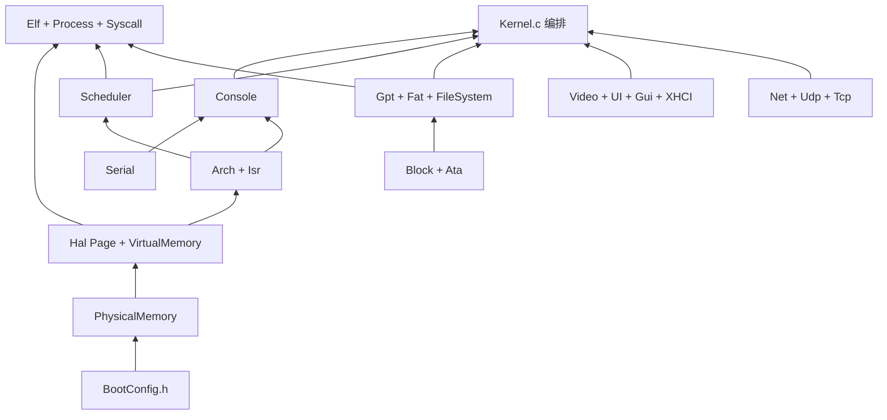

# ToyKernel 项目结构说明

本文档描述 ToyOS 内核（`ToyKernel/`）的目录结构、启动流程、模块划分、源文件职责，以及**推荐实现/阅读顺序**（第 10 节）。  
路线图见 [`路线图.md`](路线图.md)。

ToyOS 由三部分组成：

| 目录 | 作用 |
|------|------|
| `ToyBoot/` | UEFI 引导：GOP/EDID、跨卷加载 `Kernel.elf`、传入 `BOOT_CONFIG` |
| `ToyKernel/` | 裸机 x86-64 内核（本文档主体） |
| `ToyImage/` | QEMU 镜像：`run.sh`（单盘）、`run-split.sh`（Boot + `rootfs/`） |

### 多架构目录（HAL）

```
ToyKernel/
├── Include/             # BootConfig.h、hal.h、Debug.h
├── Common/
│   ├── core/            # Kernel、调度、内存、进程、系统调用
│   ├── services/        # Console、Gui、FileSystem、Udp、Tcp
│   └── lib/             # Elf、Block、Gpt、Fat、UI、HIDKeyboard
├── HAL/
│   ├── x86_64/          # Arch、Isr、Page、Io、Hal、PCIe、link.ld
│   │   └── drivers/     # Ata、Serial、XHCI、Net、Video
│   ├── riscv/           # 占位 + drivers/
│   └── arm64/           # 占位 + drivers/
├── User/                # hello / count / fork / catfile
├── Makefile
└── build.sh
```

**Common 与架构**：上层经 `Include/hal.h` 访问硬件。端口 I/O 为 `HalIoRead/Write*`（`HAL/*/Io.c`）；设备驱动在 `HAL/<arch>/drivers/`。`hal_port.h` 等架构私有头留在 `HAL/<arch>/`，不进 `Include/`。

**VMM 分层**：

```
Common/core/VirtualMemory.c   地址空间、Clone、CopyFrom/ToUser
        ↓ HalPage*
HAL/x86_64/Page.c             四级页表、TLB、CR3
```

创建空间在 `RootCopy` 后对 PML4[0] 做 `PrivatizePml4Slot`（私有 PDPT），避免用户映射写进内核共享表；`Destroy` 只卸本空间用户页。
---

## 1. 启动与内存布局

### 1.1 引导链

```
UEFI (OVMF / 真机固件)
  → EFI/BOOT/BOOTX64.EFI 或 EFI/ToyOS/BOOTX64.EFI（GRUB chainload）
    → 同卷或其它 FAT 卷上的 Kernel.elf → 固定加载到 0x100000
    → ExitBootServices
    → KernelEntry(BOOT_CONFIG*)
```

真机建议：ESP 仅放 Boot；独立 FAT（标签/`TOYOS.ID`）放 Kernel 与用户 ELF。

### 1.2 链接地址（`HAL/x86_64/link.ld`）

| 段 | 虚拟地址 | 说明 |
|----|----------|------|
| `.text` / `.rodata` | 0x100000 起 | 代码与只读数据 |
| `.bss` | 随链接增长 | 未初始化数据 |
| `__kernel_end` | bss 末 | PMM 保留内核镜像 |

低 512MB 恒等映射（2MB 大页）；帧缓冲/LAPIC/XHCI 等 MMIO 在启用分页前映射。用户区默认：`0x40000000` 代码，`0x40100000` 栈。

### 1.3 BOOT_CONFIG（`Include/BootConfig.h`）

与 `ToyBoot/Boot.c` 布局必须一致：`VideoConfig`、`MemoryMap`、`KernelEntry`、`RsdpAddress`、`SystemTable`、`XhciBaseAddress`。

---

## 2. 内核启动流程

```
KernelEntry()
  ├─ 保存 BootConfig；尽早 VideoSet（避免早期 Console 死循环）
  ├─ ModulesRun(gModules)
  ├─ SchedulerCreate("shell" / "gui" / "worker")
  └─ SchedulerStart() → LAPIC 定时器 → 抢占多任务
```

### 2.1 模块初始化顺序（`Kernel.c` → `gModules[]`）

| 顺序 | 模块 | Init | 职责 |
|------|------|------|------|
| 1 | serial | InitSerial | COM1 |
| 2 | mem | InitMem | PMM |
| 3 | vmm | InitVmm | 页表 + 分页启用 |
| 4 | video | InitVideo | 帧缓冲 |
| 5 | cpu | InitCpu | GDT/IDT/LAPIC + syscall 门 |
| 6 | fs | InitFileSystemModule | Block→GPT→FAT；`ls`/`cat`/`write` |
| 7 | usb | InitUsb | XHCI 键盘/鼠标 |
| 8 | gui | InitGuiModule | 桌面与窗口 |
| 9 | sched | InitSched | 调度器表 |
| 10 | console | InitConsole | Shell 内置命令 |

任一 Init 非 0 → 停机。

---

## 3. 中断与调度

```
硬件中断
  → Isr.S → InterruptDispatch (Arch.c)
       ├─ 异常 → 打印后停机
       ├─ VEC_XHCI → XhciIrq
       ├─ VEC_TIMER → SchedulerOnTimer（可能切任务）
       └─ VEC_SYSCALL → SyscallDispatch
  → iretq
```

任务：`shell`（键盘/串口/网络轮询）、`gui`（鼠标）、`worker`（抢占演示）、用户任务（`exec`/`fork`）。

系统调用号见 `Syscall.h`：`exit`/`write`/`open`/`read`/`close`/`fork`/`wait`/`yield`。

---

## 4. 源文件一览

### 4.1 核心入口

| 文件 | 说明 |
|------|------|
| `Common/core/Kernel.c` | `KernelEntry`、模块表、Shell/Gui/Worker、`exec`/`ps`/网络命令 |
| `Include/BootConfig.h` | 与 Boot 共享结构 |
| `HAL/x86_64/link.ld` | 内核基址 0x100000 |

### 4.2 架构与中断

| 文件 | 说明 |
|------|------|
| `Include/hal.h` | HAL 统一接口 |
| `HAL/x86_64/Hal.c` | 薄封装 |
| `HAL/x86_64/Page.c` | 页表 Map/GetEntry/Unmap |
| `HAL/x86_64/Arch.c` | GDT/IDT/LAPIC/中断分发 |
| `HAL/x86_64/Isr.S` | 中断桩、首次进入用户/内核任务 |

### 4.3 调度、内存、进程

| 文件 | 说明 |
|------|------|
| `Scheduler.c/h` | 最多 8 任务；READY/RUNNING/BLOCKED/ZOMBIE；fork/wait/yield；每任务 FD |
| `PhysicalMemory.c/h` | 位图 PMM |
| `VirtualMemory.c/h` | 地址空间、`SpaceClone`、`CopyFrom/ToUser` |
| `Elf.c/h` | 静态 ELF64 加载 |
| `Process.c/h` | `ProcessExec` / `ProcessRunDemo` |
| `Syscall.c/h` | int 0x80 分发 |
| `User/*.S` | hello、count、fork、catfile |

### 4.4 模块与控制台

| 文件 | 说明 |
|------|------|
| `Module.c/h` | 顺序 Init |
| `Console.c/h` | 串口+帧缓冲 Shell |
| `Serial.c/h` | COM1 |
| `Debug.h` | `TOY_DEBUG` 开关 |

### 4.5 显示与 GUI

| 文件 | 说明 |
|------|------|
| `Video.c/h` | 像素、字符、`VideoCopyRect`/`ReadRect`/`WriteRect` |
| `UI.c/h` | 几何与控件绘制 |
| `Gui.c/h` | 窗口、光标 save-under、标题栏拖动 |
| `FontData.h` | 字形 |

### 4.6 总线与 USB

| 文件 | 说明 |
|------|------|
| `PCIe.c/h` | 配置空间、USB 扫描 |
| `XHCI.c/h` | 键盘 + tablet |
| `HIDKeyboard.c/h` | 键码映射 |

### 4.7 存储

| 文件 | 说明 |
|------|------|
| `Block.c/h` | 当前盘读/写扇区；主/从盘选择 |
| `Ata.c/h` | ATA PIO 读/写（Primary Master/Slave） |
| `Gpt.c/h` | 定位 FAT 起始 LBA |
| `Fat.c/h` | FAT16/32 根目录读/写（8.3，≤64K 写） |
| `FileSystem.c/h` | 挂载优选 `TOYOS.ID`；注册 `ls`/`cat`/`write` |

### 4.8 网络

| 文件 | 说明 |
|------|------|
| `Net.c/h` | virtio-net、ARP、ICMP |
| `Udp.c/h`、`Tcp.c/h` | UDP / 简陋 TCP |

### 4.9 构建与镜像

| 文件 | 说明 |
|------|------|
| `Makefile` / `build.sh` | 产出 `Build/Kernel.elf` → `ToyImage/`，并复制用户 ELF |
| `ToyImage/run.sh` | 单盘 vvfat |
| `ToyImage/run-split.sh` | 盘0 Boot，盘1 `rootfs/`；`--force-second` |
| `ToyImage/prepare-rootfs.sh` | 同步 Kernel/ELF/`TOYOS.ID` |

---

## 5. 控制台命令

| 命令 | 位置 | 功能 |
|------|------|------|
| help / clear / echo | Console.c | 内置 |
| ls / cat / write | FileSystem.c | 根目录列表 / 读 / 写 |
| info / ps / mem / memtest / runuser / exec | Kernel.c | 系统与进程 |
| net / ping / udplisten / udpsend / tcplisten / tcpstatus | Kernel.c | 网络 |

---

## 6. 模块依赖关系（摘要）

### 6.1 分层

```
L4  Kernel / FileSystem / Module / Syscall / Process
L3  Arch / Scheduler / VirtualMemory / Console / Fat / Gui / Net
L2  Block·Ata / PCIe / Video·UI / PhysicalMemory / HID
L1  Serial / Isr.S
L0  BootConfig.h
```

### 6.2 存储链（读/写）

```
BlockSelect(drive)
  → BlockRead/WriteSectors → AtaRead/WriteSectors
GptFindFatStart → FatInit
FatReadFile / FatWriteFile / FatListRoot
FileSystem：优选含 TOYOS.ID 的盘，否则含 HELLO/COUNT 的从盘，否则第一 FAT
```

### 6.3 用户进程链

```
exec PATH
  → FatReadFile → ElfLoadFromMemory → SchedulerCreateUser
fork → VirtualMemorySpaceClone → 子任务 Frame.Rax=0
exit → 僵尸（有父）或直接回收；wait 阻塞收割；yield 让出
open/read/close → 任务 FD 表（打开时读入内存）
```

### 6.4 中断枢纽

`Arch.c: InterruptDispatch` 硬编码 XHCI / TIMER / SYSCALL；改 IRQ 需改此处（或日后注册表）。

更完整的 include 矩阵与 mermaid 总览可对照历史版本；以下第 10 节给出**按依赖实现时的文件顺序**（比矩阵更实用）。

---

## 7. 已知限制

- FAT：仅根目录、8.3、无删除/子目录/LFN；写 ≤64K
- wait：阻塞；已有僵尸则立即返回子 Id（`rax`）与退出码（`rdx`）；无子返回 -1
- 无动态库、无 COW
- ATA 仅 Primary 主/从；真机 NVMe/AHCI 未做
- PMM 约 512MB 跟踪；单核无锁；任务栈 4KB 嵌在 `TASK` 内
- TCP 无重传；GUI 无完整控件集

---

## 8. 主要函数索引

| 文件 | 主要符号 |
|------|----------|
| Kernel.c | KernelEntry, Init*, ShellTask, GuiTask, WorkerTask, Command* |
| Arch.c | ArchInit, InterruptDispatch, TimerStart |
| Isr.S | IsrCommon, SchedulerEnter, UserEnter |
| Scheduler.c | SchedulerCreate(User), OnTimer, Fork, Wait, Yield, ExitUser, Fd* |
| VirtualMemory.c | SpaceCreate/Clone/Destroy, CopyFrom/ToUser |
| Process.c | ProcessExec, ProcessRunDemo |
| Syscall.c | SyscallDispatch |
| Elf.c | ElfLoadFromMemory |
| Block.c | BlockInit, BlockSelect, BlockRead/WriteSectors |
| Ata.c | AtaProbe, AtaRead/WriteSectors |
| Gpt.c | GptFindFatStart |
| Fat.c | FatInit, FatListRoot, FatReadFile, FatWriteFile |
| FileSystem.c | FileSystemInit, MountBestFat |
| Gui.c | GuiInit, GuiPollMouse, 拖动 MoveWindowTo |
| Net/Udp/Tcp | 网络收发 |

---

## 9. 编译与运行

```bash
cd ToyKernel && ./build.sh              # Kernel + HELLO/COUNT/FORK/CAT → ToyImage
cd ../ToyBoot && ./build.sh             # BOOTX64.EFI
cd ../ToyImage && ./run.sh              # 单盘回归
cd ../ToyImage && ./run-split.sh        # 双盘：Boot + rootfs
# ./run-split.sh --force-second         # Kernel 只从第二盘加载
```

建议验证：

```
toyos> ls
toyos> write NOTE.TXT hello
toyos> cat NOTE.TXT
toyos> exec FORK.ELF
toyos> exec CAT.ELF
toyos> ps
toyos> ping 10.0.2.2
```

---

## 10. 推荐实现 / 阅读顺序（从哪个文件开始）

本节回答：「如果从零搭这套内核，或新人阅读代码，应按什么顺序碰哪些文件？」  
原则：**先契约与入口 → 能打印 → 能分配内存 → 能分页与中断 → 能调度 → 再叠存储/用户态/GUI/网络**。

### 10.1 总览（依赖箭头）



### 10.2 阶段 A — 引导契约与空内核（先搞懂「怎么进来」）

| 顺序 | 文件 / 位置 | 做什么 / 看什么 |
|------|-------------|-----------------|
| A1 | `Include/BootConfig.h` | 与 Boot 共享的字段；改布局必须同步 `ToyBoot/Boot.c` |
| A2 | `ToyBoot/Boot.c` | GOP、读 `Kernel.elf`（同卷/跨卷）、`ExitBootServices`、跳转 |
| A3 | `HAL/x86_64/link.ld` | 为何必须加载到 `0x100000` |
| A4 | `Common/core/Kernel.c` 的 `KernelEntry` | 最早 `VideoSet`、模块表、创建任务 |
| A5 | `Common/core/Module.c` | 顺序 Init 框架 |

此时目标：Boot 能进 `KernelEntry` 并停在安全循环（早期调试靠串口）。

### 10.3 阶段 B — 能输出（Serial → Video → Console）

| 顺序 | 文件 | 说明 |
|------|------|------|
| B1 | `Serial.c` | COM1，最早日志 |
| B2 | `Video.c` + `FontData.h` | 帧缓冲；依赖 Boot 传入的 GOP |
| B3 | `UI.c` | 可选，GUI 几何 |
| B4 | `Console.c` | Shell 行缓冲与命令表 |

**注意**：模块表里 `console` 在最后 Init，但早期 `ConsoleWrite` 仍可走 Serial/Video。

### 10.4 阶段 C — 物理内存与分页

| 顺序 | 文件 | 说明 |
|------|------|------|
| C1 | `PhysicalMemory.c` | 解析 UEFI MemoryMap，位图分配 |
| C2 | `HAL/x86_64/Page.c` | `HalPageMap` / `GetEntry` / CR3 |
| C3 | `VirtualMemory.c` | 恒等映射策略、用户空间、Clone、copy_* |

验证：`mem` / `memtest`。

### 10.5 阶段 D — 中断、定时器、调度

| 顺序 | 文件 | 说明 |
|------|------|------|
| D1 | `HAL/x86_64/Isr.S` | 保寄存器、根据返回值切栈 |
| D2 | `HAL/x86_64/Arch.c` + `Io.c` | IDT、LAPIC；端口 I/O 实现 |
| D3 | `Scheduler.c` | 任务槽、时间片、`SchedulerStart` |
| D4 | 回到 `Kernel.c` | `shell`/`gui`/`worker` 三任务 |

验证：`ps` 看到多任务 ticks 增加。

### 10.6 阶段 E — 存储（先读后写）

| 顺序 | 文件 | 说明 |
|------|------|------|
| E1 | `Block.h` / `Block.c` | 抽象读/写；选盘 |
| E2 | `Ata.c` | PIO；`0x20` 读、`0x30` 写；主/从 |
| E3 | `Gpt.c` | 找 FAT LBA |
| E4 | `Fat.c` | 先 `FatInit`/`ListRoot`/`ReadFile`，再 `WriteFile` |
| E5 | `FileSystem.c` | `MountBestFat`（`TOYOS.ID`）、注册 `ls`/`cat`/`write` |

镜像：`prepare-rootfs.sh` + `run-split.sh` 验证第二盘。

### 10.7 阶段 F — 用户态与系统调用

| 顺序 | 文件 | 说明 |
|------|------|------|
| F1 | `Syscall.c` | 先 `exit`/`write`，再 open/read/close/fork/wait/yield |
| F2 | `Elf.c` | 静态 PT_LOAD |
| F3 | `Process.c` | `ProcessExec` |
| F4 | `User/*.S` + `user.ld` | 链接到 `0x40000000`；`build.sh` 拷到 FAT |
| F5 | `Scheduler` 扩展 | `CreateUser`、`Fork`、`ExitUser` 僵尸、`Fd*` |

验证：`exec HELLO.ELF` → `FORK.ELF` → `CAT.ELF`。

### 10.8 阶段 G — USB 与 GUI

| 顺序 | 文件 | 说明 |
|------|------|------|
| G1 | `PCIe.c` | 找 xHCI |
| G2 | `XHCI.c` + `HIDKeyboard.c` | 键盘报告；tablet 鼠标 |
| G3 | `Gui.c` | 窗口、光标 save-under、标题栏拖动（`VideoCopyRect`） |

依赖：Video 已就绪；Arch 已挂 VEC_XHCI。

### 10.9 阶段 H — 网络

| 顺序 | 文件 | 说明 |
|------|------|------|
| H1 | `Net.c` | virtio-net、ARP、ICMP |
| H2 | `Udp.c` / `Tcp.c` | 应用层协议 |
| H3 | `Kernel.c` 命令与 `ShellTask` 里 `NetPoll` | |

### 10.10 阶段 I — 真机与安装（后置）

| 顺序 | 内容 |
|------|------|
| I1 | 保持 FAT + Block 接口不变，实现 NVMe 或 AHCI 后端 |
| I2 | ToyBoot：ESP 写入 / 可选建分区（慎改 GPT） |
| I3 | GRUB `chainloader` 文档（见 `ToyBoot/README.md`） |

### 10.11 「最小可运行切片」对照

若只想快速理解「现在机器上跑的是什么」，按这条捷径读：

1. `ToyBoot/Boot.c`（怎么加载）  
2. `Kernel.c` → `KernelEntry` + `gModules`  
3. `Scheduler.c` + `Isr.S`（怎么轮转）  
4. `FileSystem.c` + `Fat.c`（怎么 ls/write）  
5. `Process.c` + `Syscall.c` + `User/fork.S`（怎么用户态）  
6. `Gui.c`（怎么窗口）  

其余文件按上面 A→I 在需要改功能时再下钻。

---

## 11. 文档维护

- 功能阶段状态以 [`路线图.md`](路线图.md) 为准。  
- 改 Boot↔Kernel 共享结构时，同步 `BootConfig.h` 与 `ToyBoot/Boot.c`。  
- 新增模块：加入 `gModules[]`、本文件第 4/8/10 节，并更新路线图「建议的下一步」。
