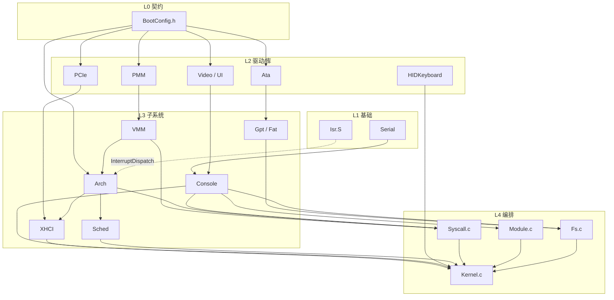

# ToyKernel 项目结构说明

本文档描述 ToyOS 内核（`ToyKernel/`）的目录结构、启动流程、模块划分与各源文件职责。  
ToyOS 由三部分组成：

| 目录 | 作用 |
|------|------|
| `ToyBoot/` | UEFI 引导程序，加载 `Kernel.elf` 并传入 `BOOT_CONFIG` |
| `ToyKernel/` | 裸机 x86-64 内核（本文档主体） |
| `ToyImage/` | QEMU 启动镜像（`OVMF.fd` + FAT 磁盘上的 `Kernel.elf`） |

### 多架构目录（HAL）

```
ToyKernel/
├── common/          # 架构无关上层：调度、内存、FS、Console、USB…
├── hal/
│   ├── hal.h        # HAL 统一接口（上层只 include 此文件）
│   ├── x86_64/      # 当前完整实现：Arch.c、Isr.S、Hal.c、link.ld
│   ├── riscv/       # 占位骨架（待 Trap/PLIC/SBI）
│   └── arm64/       # 占位骨架（待 GIC/Generic Timer）
├── user/            # 用户态示例（目前仅 x86_64）
├── Makefile         # ARCH=x86_64|riscv|arm64
└── build.sh         # ./build.sh [ARCH]
```

编译：`make ARCH=x86_64` 或 `./build.sh`。`common/` 通过 `hal.h` 访问 CPU/中断/分页，不直接 `#include` 架构目录。

**VMM 分层**（已完成）：

```
common/Vmm.c          地址空间策略、用户区布局、CopyFromUser
        ↓ HalPageMap / HalLoadPageTable / …
hal/x86_64/Page.c     x86 四级页表、TLB、CR3
```

---

## 1. 启动与内存布局

### 1.1 引导链

```
UEFI (OVMF)
  → ToyBoot.efi (EFI/BOOT/BOOTX64.EFI)
    → 读取 Kernel.elf，固定加载到 0x100000
    → ExitBootServices
    → 跳转 KernelEntry(BOOT_CONFIG*)
```

### 1.2 链接地址（`hal/x86_64/link.ld`）

| 段 | 虚拟地址 | 说明 |
|----|----------|------|
| `.text` / `.rodata` | 0x100000 起 | 代码与只读数据 |
| `.bss` | 0x107000 起 | 未初始化全局变量 |
| `__kernel_end` | bss 末尾 | 内核镜像结束符号，PMM 用于保留 |

内核低地址区（0–512MB）为**恒等映射**（2MB 大页）；高位 MMIO（帧缓冲、LAPIC、XHCI）在启用分页前额外映射。用户态页映射见 `Vmm.c` / `Syscall.c`。

### 1.3 BOOT_CONFIG（`BootConfig.h`）

由 `ToyBoot/Boot.c` 与内核共享，布局必须一致：

- `VideoConfig` — GOP 帧缓冲信息
- `MemoryMap` — UEFI 内存映射（`ExitBootServices` 后仍有效）
- `KernelEntry` / `RsdpAddress` / `SystemTable` / `XhciBaseAddress`

---

## 2. 内核启动流程

```
KernelEntry()
  ├─ 保存 BootConfig 指针与副本
  ├─ ModulesRun() 按序初始化各模块
  ├─ SchedCreate("shell", ShellTask)
  ├─ SchedCreate("gui", GuiTask)
  ├─ SchedCreate("worker", WorkerTask)
  └─ SchedStart() → LAPIC 定时器 → 抢占式多任务
```

### 2.1 模块初始化顺序（`Kernel.c` → `gModules[]`）

| 顺序 | 模块名 | 初始化函数 | 职责 |
|------|--------|------------|------|
| 1 | serial | InitSerial | COM1 串口 |
| 2 | mem | InitMem | 物理页分配器 PMM |
| 3 | vmm | InitVmm | `HalPageKernelSetup` 恒等映射 + MMIO + `HalPagingEnable` |
| 4 | video | InitVideo | 帧缓冲与清屏 |
| 5 | cpu | InitCpu | `HalInit` + `HalSyscallInit`（GDT/IDT/LAPIC） |
| 6 | fs | InitFsModule | ATA → GPT → FAT → ls/cat |
| 7 | usb | InitUsb | PCI 扫描 XHCI + 键盘/鼠标 |
| 8 | gui | InitGuiModule | 桌面窗口与光标 |
| 9 | sched | InitSched | 调度器数据结构 |
| 10 | console | InitConsole | Shell 命令表 |

任一模块 `Init()` 返回非 0 则内核停机。

---

## 3. 中断与调度

```
硬件中断
  → Isr.S: isr_N → isr_common（保存寄存器）
  → Arch.c: InterruptDispatch()
       ├─ vec < 32  → ExceptionHalt（打印后死循环）
       ├─ VEC_XHCI (0x40) → XHCIIrq()
       ├─ VEC_TIMER (0x41) → SchedOnTimer()，可能切换 RSP
       ├─ VEC_SYSCALL (0x80) → SyscallDispatch()
       └─ PIC 向量 → PicEoi
  → isr_common: 若 rax≠0 则 mov rsp,rax（上下文切换）
  → iretq 返回任务
```

- **Shell 任务**：`HalCpuHalt()` 等待 USB/串口中断，处理键盘输入
- **Gui 任务**：`HalCpuHalt()` 等待鼠标中断，增量更新光标（不整屏重绘）
- **Worker 任务**：空转计数，被定时器抢占
- **SchedEnter**：首次进入任务（不经过中断帧）

---

## 4. 源文件一览

### 4.1 核心入口

| 文件 | 说明 |
|------|------|
| `common/Kernel.c` | 内核主入口、模块表、Shell/GUI/Worker 任务、控制台扩展命令 |
| `common/Kernel.h` | 声明 `KernelEntry` |
| `common/BootConfig.h` | 与 Bootloader 共享的数据结构 |
| `hal/x86_64/link.ld` | 链接脚本，内核加载基址 0x100000 |

### 4.2 架构与中断

| 文件 | 说明 |
|------|------|
| `hal/hal.h` | HAL 统一接口（CPU/中断/定时器/分页） |
| `hal/x86_64/Hal.c` | x86-64 HAL 薄封装，委托给 `Arch.c` / `Serial` |
| `hal/x86_64/Page.c` | x86-64 四级页表遍历、`HalPageMap`、`invlpg`/`cr3` |
| `hal/x86_64/Arch.c` / `Arch.h` | GDT、IDT、PIC 屏蔽、LAPIC、定时器、中断分发 |
| `hal/x86_64/Isr.S` | 中断桩代码：保存 GPR、`InterruptDispatch`、上下文切换、`SchedEnter` |

### 4.3 调度与内存

| 文件 | 说明 |
|------|------|
| `Sched.c` / `Sched.h` | 最多 8 任务、时间片轮转、抢占切换 |
| `Pmm.c` / `Pmm.h` | 基于 UEFI 内存映射的位图物理页分配器 |
| `common/Vmm.c` / `Vmm.h` | **策略层**：地址空间、`CopyFromUser`；映射委托 `HalPage*` |
| `common/Elf.c` / `Elf.h` | 静态 ELF64 加载 |
| `Process.c` / `Process.h` | `ProcessExec`、`UserRunDemo` |
| `Syscall.c` / `Syscall.h` | int 0x80；`SYS_write` 经 `CopyFromUser` 读用户缓冲 |
| `user/hello.S`、`user/count.S` | 用户态演示程序 |

### 4.4 模块框架与控制台

| 文件 | 说明 |
|------|------|
| `Module.c` / `Module.h` | 顺序执行 `MODULE` 初始化表 |
| `Console.c` / `Console.h` | 双通道 Shell（串口 + 帧缓冲）、命令注册与行编辑 |
| `Serial.c` / `Serial.h` | COM1 (0x3F8) 轮询式串口输出 |

### 4.5 显示与 GUI

| 文件 | 说明 |
|------|------|
| `common/Video.c` / `Video.h` | 帧缓冲像素读写、`VideoFillRect`、8×16 字体 |
| `common/UI.c` / `UI.h` | 高级绘图：线、矩形、圆、按钮、进度条 |
| `common/Gui.c` / `Gui.h` | 简易窗口管理器、USB 鼠标/键盘光标 |
| `common/FontData.h` | ASCII 可打印字符位图数据 |

**GUI 光标**：`HalIrqDisable` 下 save-under（保存 13×13 像素 → 画十字 → 移动时还原）；
鼠标一批事件只更新到**最后位置**，避免抢占导致 XOR/局部重绘残留。

### 4.6 总线与 USB

| 文件 | 说明 |
|------|------|
| `PCIe.c` / `PCIe.h` | PCI 配置空间读写、USB 控制器扫描、MSI/MSI-X |
| `common/XHCI.c` / `XHCI.h` | xHCI 驱动、USB 键盘 + 平板（鼠标）MSI-X 中断 |
| `HIDKeyboard.c` / `HIDKeyboard.h` | HID 键码 → ASCII 映射 |

### 4.7 文件系统

| 文件 | 说明 |
|------|------|
| `Ata.c` / `Ata.h` | ATA PIO 主盘读写（QEMU `fat:rw:` 虚拟盘） |
| `Gpt.c` / `Gpt.h` | 识别 superfloppy / MBR / GPT，定位 FAT 分区 |
| `Fat.c` / `Fat.h` | FAT16/FAT32 根目录列举与文件读取（8.3 名） |
| `Fs.c` / `Fs.h` | 组装 ATA+GPT+FAT，注册 `ls`/`cat` 命令 |

### 4.8 构建

| 文件 | 说明 |
|------|------|
| `Makefile` | gcc 编译 + ld 链接，产物在 `Build/Kernel.elf` |
| `build.sh` | `make` 后复制到 `../ToyImage/Kernel.elf` |

---

## 5. 控制台命令

| 命令 | 注册位置 | 功能 |
|------|----------|------|
| help / clear / echo | Console.c | 内置 |
| ls / cat | Fs.c | 根目录列表 / 读文件 |
| info / ps / mem / memtest / runuser / exec | Kernel.c | 视频信息 / 任务列表 / 内存 / runuser / FAT 加载 ELF |

---

## 6. 模块依赖关系（详细）

本节从**分层**、**编译期 include**、**初始化时序**、**运行时调用**四个角度描述耦合关系。

### 6.1 分层模型

```
┌─────────────────────────────────────────────────────────────┐
│ L4 应用编排    Kernel.c  Fs.c  Module.c  Syscall.c          │
├─────────────────────────────────────────────────────────────┤
│ L3 子系统      Arch  XHCI  Sched  Vmm  Console  Fat  Gpt    │
├─────────────────────────────────────────────────────────────┤
│ L2 驱动/库     PCIe  Ata  Video  UI  Pmm  HIDKeyboard       │
├─────────────────────────────────────────────────────────────┤
│ L1 基础        Serial  Isr.S  FontData.h                    │
├─────────────────────────────────────────────────────────────┤
│ L0 契约        BootConfig.h（与 ToyBoot 共享，无代码依赖）    │
└─────────────────────────────────────────────────────────────┘
```

| 层级 | 模块 | 特点 |
|------|------|------|
| L0 | `BootConfig.h` | 纯数据结构，全项目共享契约 |
| L1 | Serial, Isr.S | 几乎不依赖其他内核模块 |
| L2 | PMM, Video, UI, PCIe, Ata, HIDKeyboard | 可独立编译，少量向下依赖 |
| L3 | VMM, Arch, Sched, Console, XHCI, Gpt, Fat | 组合 L2，被 L4 编排 |
| L4 | Kernel, Fs, Module, Syscall | 启动编排、命令注册、跨子系统 glue |

### 6.2 编译期依赖（`#include` 方向）

箭头表示 **A → B**（A 的 `.c` 文件 `#include` 了 B 的头文件）。

```
BootConfig.h  ←── 几乎所有 .h（公共类型 UINT32、PAGE_SIZE 等）

Serial.h      ←── Serial.c, Console.c, Syscall.c, Kernel.c

Video.h       ←── Video.c, UI.c, Console.c, Syscall.c, Kernel.c
FontData.h    ←── Video.c
UI.h          ←── UI.c, Console.c, Kernel.c, Syscall.c

Pmm.h         ←── Pmm.c, Vmm.c, Syscall.c, Kernel.c
Vmm.h         ←── Vmm.c, Syscall.c, Kernel.c

Arch.h        ←── Arch.c, Sched.c, XHCI.c, Syscall.c, Kernel.c
Isr.S         ←──（汇编，链接期依赖 Arch.c 的 InterruptDispatch）

Sched.h       ←── Sched.c, Arch.c, Kernel.c

Console.h     ←── Console.c, Module.c, 以及几乎所有需要打印的 .c
                （Pmm, Vmm, Arch, PCIe, XHCI, Ata, Gpt, Fat, Fs, Sched, Syscall）

PCIe.h        ←── PCIe.c, XHCI.h, Kernel.c
XHCI.h        ←── XHCI.c, Arch.c, Kernel.c
HIDKeyboard.h ←── HIDKeyboard.c, Kernel.c

Ata.h         ←── Ata.c, Gpt.c, Fat.c, Fs.c
Gpt.h         ←── Gpt.c, Fs.c
Fat.h         ←── Fat.c, Fs.c
Fs.h          ←── Fs.c, Kernel.c

Syscall.h     ←── Syscall.c, Arch.c, Kernel.c
Module.h      ←── Module.c, Kernel.c
```

**无 include 依赖的独立模块**（仅依赖 BootConfig 或标准头）：

- `Serial.c` — 只依赖 `Serial.h`
- `HIDKeyboard.c` — 只依赖 `HIDKeyboard.h`
- `Video.c` — 只依赖 `Video.h` + `FontData.h`
- `UI.c` — 只依赖 `UI.h` + `Video.h`

### 6.3 初始化时序依赖

`ModulesRun()` 严格按序执行；后序模块**隐式依赖**前序模块已就绪。

```
serial ──► mem ──► vmm ──► video ──► cpu ──► fs ──► usb ──► sched ──► console
  │         │       │        │        │      │      │        │          │
  │         │       │        │        │      │      │        │          └─ 需要 ConsoleRegister 表为空
  │         │       │        │        │      │      │        └─ 仅数据结构，无硬件依赖
  │         │       │        │        │      │      └─ 需要 Arch(IDT) + 分页后 MMIO 可访问
  │         │       │        │        │      └─ 仅 PIO 读盘，与 USB 无硬依赖
  │         │       │        │        └─ 需要 LAPIC MMIO 已映射；注册 syscall 门
  │         │       │        └─ 需要帧缓冲 MMIO 已映射（InitVmm 中 VmmMapIdentity）
  │         │       └─ 需要 PMM 分配页表；映射 FB/LAPIC/XHCI 后启用分页
  │         └─ 需要 BootConfig.MemoryMap；串口已可用于早期调试
  └─ 必须第一个：后续模块失败时仍可能打印
```

| 模块 | 硬依赖（必须在前） | 软依赖（功能上需要） |
|------|-------------------|---------------------|
| Serial | 无 | 无 |
| PMM | Serial（日志） | BootConfig 内存映射 |
| VMM | PMM | Serial；BootConfig 中的 FB/XHCI 地址 |
| Video | VMM | BootConfig.VideoConfig |
| Arch/CPU | VMM | Console；后续 XHCI/Sched 的中断向量 |
| FS | Arch（非必须，但 Console 已可用） | Console |
| USB | VMM + Arch | PCIe 或 BootConfig.XhciBaseAddress |
| Sched | 无硬件 | Console（日志） |
| Console | Video + Serial | 前面各模块注册的命令 |

**注意**：`Module.c` 在打印 `[mod]` 日志时调用 `ConsoleWrite`，但 `ConsoleInit()` 在**最后**才执行——因此启动日志实际走 `ConsoleWrite` → `SerialWrite` + `DrawString`，此时命令表尚未建立，属正常行为。

### 6.4 运行时调用与中断依赖

#### 6.4.1 中断分发枢纽（Arch 为中心）

```
                    Isr.S (isr_common)
                           │
                           ▼
                  Arch.c: InterruptDispatch
                    /      |       \
                   /       |        \
           异常(<32)   VEC_XHCI   VEC_TIMER    VEC_SYSCALL
              │           │          │              │
              ▼           ▼          ▼              ▼
        ExceptionHalt  XHCIIrq  SchedOnTimer  SyscallDispatch
                           │          │              │
                           │          ▼              ├─► Serial + Video (write)
                           │     Sched.c            └─► Console (exit 消息)
                           │     切换任务 RSP
                           ▼
                    XHCI 键盘队列
                           │
                           ▼
              Kernel.c: ShellTask → FeedHid → ConsoleOn*
```

**耦合特征**：`Arch.c` 在编译期直接 `#include` 了 `XHCI.h`、`Sched.h`、`Syscall.h`，是**中断层的集中分发器**，新增 IRQ 源需改 `Arch.c`（或通过函数指针解耦，当前未做）。

#### 6.4.2 Shell 输入输出链

```
USB 键盘 ──► XHCI ──► ShellTask ──► Console ──┬──► Serial
串口输入 ─────────────────────────────────────┤
                                              └──► Video ──► 帧缓冲
```

`Console` 是 **I/O 汇聚点**：所有命令处理函数（Kernel.c、Fs.c）通过 `ConsoleWrite` 输出；输入来自 Shell 任务（USB + 串口双通道）。

#### 6.4.3 内存子系统链

```
BootConfig.MemoryMap
        │
        ▼
     Pmm.c ──alloc──► Vmm.c（页表页）
        │                  │
        │                  └──► Syscall.c（用户页映射）
        │
        └──► Kernel.c（memtest 命令）
```

VMM **依赖** PMM 分配页表；PMM **不依赖** VMM（启动时仍用物理地址直接访问）。

#### 6.4.4 存储子系统链（单向，无反向依赖）

```
Ata.c ──PIO 扇区读──► Gpt.c ──分区 LBA──► Fat.c ──目录/文件──► Fs.c ──注册──► Console
```

`Ata` / `Gpt` / `Fat` 之间是**严格单向流水线**；与 USB、Sched、VMM 无交叉依赖（耦合度低）。

#### 6.4.5 USB 子系统链

```
PCIe.c ──配置空间──► XHCI.c ──MSI-X──► Arch.c（VEC_XHCI）
                         │
                         └──► HIDKeyboard.c（纯查表，无硬件调用）
```

`XHCI.c` 依赖 `Arch.h`（`LapicEoi` 等）和 `PCIe.h`；`PCIe.c` 仅依赖 `Console` 打日志。

#### 6.4.6 调度与任务

```
Kernel.c: SchedCreate / SchedStart
              │
              ▼
         Sched.c ◄──── TimerStart() ──── Arch.c
              │
              ▼
         Isr.S: SchedEnter / 上下文切换
              │
              ▼
    ShellTask（Console + XHCI + Serial）
    WorkerTask（独立计数，无模块依赖）
```

调度器**不直接依赖** USB/FS/VMM；Shell 任务在运行时**胶水式**连接 Console 与 XHCI。

#### 6.4.7 用户态 / 系统调用

```
runuser 命令 (Kernel.c)
    → UserRunDemo (Syscall.c)
        → PmmAllocPage + VmmMapPage
        → ArchTssInstall (Arch.c)
        → UserEnter (Isr.S) → Ring 3
            → int 0x80 → SyscallDispatch
                → SYS_write → Serial + Video
                → SYS_exit  → Console → 停机
```

横跨 **VMM + Arch + PMM + Console + Serial + Video**，是耦合面最广的单条路径之一。

### 6.5 耦合强度矩阵

「被依赖次数」≈ 有多少模块在编译期或运行时会调用它。

| 模块 | 被依赖程度 | 依赖他人的程度 | 评价 |
|------|-----------|---------------|------|
| **BootConfig.h** | 极高（全局契约） | 无 | 数据耦合，不可避免 |
| **Console** | 极高（12+ 模块打日志/命令） | 中（Serial, Video, UI） | **日志枢纽**，改动影响面大 |
| **Arch** | 高（中断/定时器/TSS） | 高（XHCI, Sched, Syscall） | **中断枢纽**，双向耦合 |
| **Serial** | 高 | 极低 | 较健康的底层服务 |
| **PMM** | 中（VMM, Syscall） | 低（仅 Console 日志） | 较独立 |
| **VMM** | 中 | 中（PMM, Console） | 较独立 |
| **Video / UI** | 中（Console, Syscall） | 低 | 显示层，边界清晰 |
| **XHCI** | 中（Arch, ShellTask） | 中（PCIe, Arch, Console） | 驱动典型耦合 |
| **Sched** | 中（Arch, Kernel） | 低（Arch, Console） | 较独立 |
| **PCIe** | 低（仅 XHCI） | 低（Console） | 边界清晰 |
| **Ata→Gpt→Fat** | 低（仅 Fs 组装） | 链式单向 | **内聚最好**的子系统 |
| **HIDKeyboard** | 极低 | 无 | 纯函数库，零耦合 |
| **Module** | 低 | 低（Console） | 薄封装 |
| **Syscall** | 低 | 高（跨多模块） | 编排层，依赖多但不被依赖 |

### 6.6 耦合热点与改进方向

| 热点 | 现状 | 阶段 2+ 建议 |
|------|------|-------------|
| Console 兼做日志 + Shell | 各驱动 `#include "Console.h"` 打日志 | 拆出 `Log.c`（仅 Serial），Console 只管命令行 |
| Arch 硬编码分发 | 新增 IRQ 必改 `InterruptDispatch` | 向量 → handler 注册表 |
| Kernel.c 过重 | 模块 Init、命令、Shell 任务全在一文件 | Init 表可保留；命令按模块分散注册（Fs 已示范） |
| VMM 与内核页表 | `HalPageKernelRoot` + 每进程 `VM_ADDR_SPACE.Root` | 已实现进程隔离；可进一步减少 exec 后内核用户区 PTE 残留 |
| Syscall 直接读用户指针 | `CopyFromUser` 校验用户区 PTE | 可扩展 `copy_to_user` |

### 6.7 总览图（编译期 + 运行时）



---

## 7. 已知限制

- 每进程独立 CR3（`VM_ADDR_SPACE`），`exec` 从 FAT 加载静态 ELF
- `SYS_write` 使用 `CopyFromUser` 校验用户指针
- 尚无 `fork` / `wait`；页表目录与内核浅共享
- FAT 仅根目录、8.3 短文件名、只读
- XHCI 仅支持 QEMU usb-kbd，单键盘
- PMM 最大跟踪 512MB，单核无锁
- 任务栈固定 4KB，编译期内嵌在 `TASK` 结构体中

---

## 8. 各文件函数索引

各源文件头部及每个函数上方均有中文注释。以下为按模块的快速索引（详见源文件）：

| 文件 | 主要函数 |
|------|----------|
| Kernel.c | KernelEntry, Init*, ShellTask, WorkerTask, Cmd* |
| Arch.c | ArchInit, InterruptDispatch, TimerStart, GdtLoad, IdtLoad |
| Isr.S | isr_common, SchedEnter, isr_0..isr_65 |
| Sched.c | SchedInit, SchedCreate, SchedOnTimer, SchedStart |
| Pmm.c | PmmInit, PmmAllocPage(s), PmmFreePage(s) |
| Console.c | ConsoleInit, ConsoleRegister, ConsoleOn* |
| Serial.c | SerialInit, SerialWrite, HexFormat |
| Video.c | SetVideo, DrawPixel, DrawChar, DrawString |
| UI.c | DrawLine, DrawRectangle, DrawButton, ... |
| PCIe.c | PciRead/WriteConfig, PciScanUSBControllers, PciEnableMsi |
| XHCI.c | XHCIInit64, XHCIIrq, XHCIDequeueKeyboard |
| HIDKeyboard.c | HIDKeyCodeToASCII, HIDKeyCodeToName |
| Ata.c | AtaInit, AtaReadSectors |
| Gpt.c | GptFindFatStart |
| Fat.c | FatInit, FatListRoot, FatReadFile |
| Fs.c | FsInit |
| Module.c | ModulesRun |

---

## 9. 编译与运行

```bash
cd ToyKernel && ./build.sh      # 生成并复制 Kernel.elf
cd ../ToyImage && ./run.sh      # QEMU + OVMF + USB 键盘
```

串口输出 `-serial stdio`，可用 `mem`、`ps`、`ls` 等命令验证各子系统。
